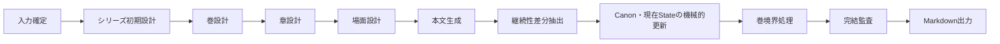

# Storycraft

利用者が手入力したbrief、または自由なkeywordsからLLMが生成したbriefを起点に、個人出版向けの日本語小説シリーズを最後まで書き切るCLIです。

次期仕様では、本文前に**シリーズ初期設計**でCanonと現在Stateの開始点を確定し、巻設計、章設計、場面設計、本文、継続性差分抽出、コードによるCanon更新を順に進めます。LLMレビューは品質改善に使いますが、レビューのseverityや合否だけで進行を止めません。停止するのは、構造契約違反、未知ID、本文根拠不一致、保存失敗など、コードで判定できる問題だけです。

> 現行実装との対応状況は[現行実装の位置付け](docs/product/IMPLEMENTATION_STATUS.md)を参照してください。今回の文書は次期仕様であり、未実装の契約を含みます。

## 文書

| 文書 | 内容 |
|---|---|
| [要件](docs/product/REQUIREMENTS.md) | 製品として変えてはいけない利用者向けの約束 |
| [製品仕様](docs/product/SPECIFICATION.md) | 入出力、製品フェーズ、採用、再開、出力の正本 |
| [現行実装の位置付け](docs/product/IMPLEMENTATION_STATUS.md) | 現行コードと次期仕様の差分 |
| [シリーズエンジン設計方針](docs/design/series_engine_design.md) | 正本候補、採用、停止、再開、永続化の設計契約 |
| [シリーズ生成フロー設計](docs/design/series_engine_flow.md) | LLM呼び出しの依存関係、順番、変更権限の正本 |
| [プロンプトテンプレートと出力契約](docs/design/prompt_template_design.md) | 次期template構成、入力・出力契約、決定的検証の設計 |

## 大きな流れ



各品質改善対象は、構造正常な候補を生成してから、対象全体のレビュー、一括修正、全体再レビューを設定回数まで行います。上限後も構造正常な最新候補を採用し、残存issueは監査記録に残します。

## インストール

Python 3.11以上が必要です。

```bash
python -m pip install .
```

開発環境では、リポジトリ直下から次のように実行できます。

```bash
PYTHONPATH=src .venv/bin/python -m storycraft.cli --help
```

## 最短実行（現行CLI）

初回briefは、人がYAML/JSONで渡すか、自由なkeywordsからLLMに生成させます。

```bash
# 手入力brief
storycraft run --out ./my-series --brief ./brief.yaml

# keywordsを複数指定してbriefをLLM生成
storycraft run --out ./my-series \
  --keywords '海洋幻想譚' \
  --keywords '4巻、静かな希望のある結末'
```

`run` は未保存の作業場所で連続実行し、`resume` は保存済み状態から続行します。`step` は次の保存可能な単位だけを実行します。正確な現行CLI契約は `storycraft --help` と[現行実装の位置付け](docs/product/IMPLEMENTATION_STATUS.md)を参照してください。

## 開発時の検証

```bash
PYTHONPATH=src .venv/bin/python -m unittest discover -s tests -v
PYTHONPATH=src .venv/bin/python -m compileall -q src tests
git diff --check
bash scripts/wheel_smoke.sh
```

実LLMによる作品内容・販売原稿としての品質は、別途の実装・実行監査が終わるまで主張しません。
