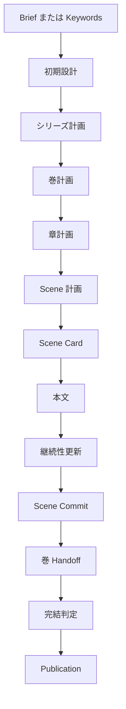

# Storycraft V1 仕様

## 1. 文書の位置づけ

この文書は Storycraft V1 の唯一の仕様正本です。製品の振る舞い、保存される成果物、品質・復旧・公開の契約を定めます。実装状況は[IMPLEMENTATION_STATUS.md](IMPLEMENTATION_STATUS.md)に記録しますが、仕様を変更しません。

対象読者は利用者と実装・試験の担当者です。用語、画面やCLIの細部、JSONの厳密な形式は実装に合わせて更新しますが、ここで定める契約を弱めてはなりません。

## 2. 目的と範囲

Storycraft は、Brief または Keywords から日本語の長編シリーズを段階的に設計・執筆し、継続性を管理して Markdown Publication を作るローカル実行型CLIです。

V1 は次を前提とします。

- 日本語、4〜10巻、単一利用者、単一 writer、単一ローカル workspace
- 外部 LLM Provider を利用した物語の生成・意味的評価
- `run`、`resume`、`step`、`status`、`validate` による操作
- 確定済み成果物からの Markdown Publication

V1 の対象外は、複数 writer の同時編集、分散実行、remote workspace、自動Web検索、他会話の記憶取得、Gitを実行状態の正本にすること、Publication時の本文再生成です。

## 3. 入力と利用者操作

新規作品は Brief または Keywords の**正確に一方**から始めます。両方指定、未指定、巻数範囲外、必須条件と avoid 条件の明示矛盾は拒否します。

Brief は題名、ジャンル、premise、必須要素、avoid、結末希望、巻数、言語を表します。Keywords から作る Brief は、明示条件を保持した Candidate を生成し、形式検証後に LLM Review を必ず通します。Review は premise、結末希望、avoid、必須要素、日本語品質の実質的な取り違えを検査します。

- `run`: 新規 workspace を作り、停止・失敗・完了まで実行する。
- `resume`: 保存済み workspace を検証・復旧してから再開する。
- `step`: 復旧が必要なら先に復旧し、次の一工程だけを実行する。
- `status`: 状態を変更せずに表示する。
- `validate`: workspace 全体を変更せず検証する。

## 4. 正本、成果物、保存

各情報種別には正本を一つだけ持ちます。

| 情報 | 正本 |
|---|---|
| 作品の事実、人物・関係・世界・Thread・Knowledge・時系列の現在値 | 確定 Generation |
| 実行位置、停止理由、現在の Generation／Publication、保留確定 | run-state |
| 物語構造と次の作業の意図 | 採用済み Plan と Scene Card |
| 読者向け出力 | 確定 Publication |
| LLM 呼出しの設定・入出力・利用量・失敗 | Call audit |

Plan は予定であり事実ではありません。本文と Evidence がない限り、Canon、State、Knowledge、Thread を更新してはなりません。Handoff、Context、Review、Revision、Audit は補助成果物であり、Generation を上書きしません。

確定済み Generation、Scene、Plan、Handoff、Completion、Publication は不変です。変更可能な単一ファイルは完全な内容を atomic replacement し、複数ファイルの成果物は staging directory を完成させてから directory 単位で確定します。途中成果物を正本として見せず、既存の確定成果物を上書きしません。

`current_generation_id` は Initial Generation 確定前だけ `null` を許可します。確定後に欠落・不実在なら重大不整合です。

## 5. 制作工程

工程は次の順序で進みます。巻・章・Scene の数は計画の範囲内で可変です。

初期設計は Concept、人物、関係、世界、Knowledge、Thread、結末を整合させ、Initial Generation として確定します。計画は Series → Volume → Chapter → Scene の順で作り、各 Plan は基準 Generation を明示します。

Scene Card は本文執筆の局所制約、POV、許可された更新、開示制約を持ちます。Scene 本文は Card と固定した基準 Generation に従います。継続性更新は本文の Evidence を引用し、許可された更新だけを提案します。Scene Commit は本文、検証済み更新、新しい Generation を一つの確定単位として扱います。

巻の完了後、Handoff は確定 Scene、Generation、Plan、Evidence を根拠に LLM が作る意味的補助要約です。コードは source reference を検証し、LLM は重要事項の脱落、誤帰属、根拠のない追加を検査します。次巻計画は Handoff を補助として使えますが、事実は必ず Generation から読むものとします。

## 6. LLM、Review、Revision

LLM は創作、意味的要約、物語品質・矛盾・欠落・誤帰属の評価を担当します。ID、schema、列挙値、参照実在、状態遷移、保存、atomic確定、Recovery、Publication は決定的なコードが担当します。

すべての LLM 生成 Candidate は次の手順を満たします。

1. 生成または要約する。
2. schema、必須項目、ID、参照、更新可能範囲をコードで検証する。
3. 独立した LLM Review を実行する。
4. error Issue があれば、限定された Revision を行う。
5. 再 Review で error がない Candidate だけを採用する。

Review は Candidate を書き換えません。Revision は Candidate 全体を置換し、指摘対象外を無断変更してはなりません。Issue は対象 artifact、field path または本文範囲へ解決できる `evidence_locator` を持ち、解決できない Issue を Revision 入力に渡しません。

Review と Revision の回数、通信 retry、形式 retry は operation ごとに上限を持ち、Call audit に残します。形式不正は再送対象、意味的な error は Revision 対象です。既に確定した成果物を再生成して別結果を探索してはなりません。

## 7. Context、秘密、要約

Context は Authority ではなく、対象 operation に必要な根拠だけを束ねる読み取り用入力です。作者用情報、人物が知る情報、読者に開示済みの情報を区別します。Writer には POV 外の秘密や未許可の開示を渡さず、Provider へ Credential を渡しません。

長い根拠を縮める必要があるときは、source artifact、範囲、basis Generation を保持する LLM の意味的要約を作ります。先頭・末尾の抜粋、固定行数・固定文字数の切り詰め、本文の機械連結を要約として使いません。要約も Candidate として Review、必要時 Revision、再 Review を受けます。

外部入力はデータとして区切り、命令として実行しません。自動Web取得、外部操作、秘密情報の保存・出力を禁止します。

## 8. Provider、失敗、利用量

Provider は LLM が必要な operation でだけ初期化します。Recovery、`status`、`validate`、確定・公開などの code-only 処理は Provider を必要としません。

通信失敗、timeout、形式不正、設定・Credential 不正、意味的 error、内部 error を区別します。再試行は同じ Candidate を壊さず、回数・待機・結果を記録します。利用量、token、費用、Call 数の上限は run 開始時に見積もり、全 LLM Call に適用します。

Budget 到達後は新規 LLM Call を開始しません。ただし、既存 Candidate の検証・採用、atomic確定、状態更新、Recovery、安全停止は続けます。Budget 節約を理由に必須 Review や error 後の Revision を省略して採用してはなりません。

## 9. 中断と復旧

workspace は排他 lock を取得して操作します。起動時は、run-state、参照、pending commit、staging、確定 directory を検証し、次のいずれかを選びます。

- **resume**: 不足していない安全な次工程から続ける。
- **regenerate**: 確定前の不完全 Candidate だけを作り直す。
- **manual**: 正本・参照・確定物の矛盾を検出したため、人間確認を求める。

Recovery は前進型で、確定済み成果物を戻したり上書きしたりしません。Scene Commit と Publication の途中 crash では、staging と pending commit を使って、同じ成果物を二重確定せず、不要な LLM Call を増やさずに収束します。

## 10. 完結と公開

全巻が完了し、必要な Thread、Ending、Arc を根拠とともに評価できるときだけ Completion を実行します。Completion は `complete`、`complete_with_issues`、`incomplete` を返します。

Completion の意味評価は一回を基本とし、望ましい status を得るために入力集合や結論を変えて再評価してはなりません。直後の Review は、評価対象、Check、Issue、Evidence、summary、status の整合だけを検査します。Revision は説明と参照の訂正だけに限り、status や Check 判定を変えません。

Publication は確定済み Scene と Completion から決定的に組み立てます。新しい物語本文や設定を生成せず、作者用情報を含めません。巻・章・Scene の順序、Completion との整合、出力の完全性を検証して確定します。`complete_with_issues` は警告を明示して公開できますが、`incomplete` は通常 Publication を作りません。

## 11. 品質と受入条件

V1 の受入では、少なくとも次を確認します。

- Brief と Keywords の入力検証、全工程の正常実行、`step`、停止後 `resume`
- LLM Candidate の形式検証、Review／Revision／再 Review、Evidence と更新範囲の検証
- 日本語本文、POV・開示制約、Plan と確定事実の分離
- immutable成果物、atomic確定、lock、Scene／Publication の crash recovery
- 完結判定、Publication順序、作者用情報除外、再構築の決定性
- Provider失敗・timeout・Budget・Call audit、Credential 非保存
- hermetic な自動試験、インストール済みCLIの smoke、実装状況の時点記録

## 12. 変更管理

仕様変更はこの文書を先に更新し、実装、試験、実装状況、README の順に整合させます。実装状況、レビュー記録、fixture は仕様正本ではありません。新しい正本、Authority、状態、保存形式、外部連携を増やす前に、既存契約で表現できない理由と復旧・検証方法を確認します。
