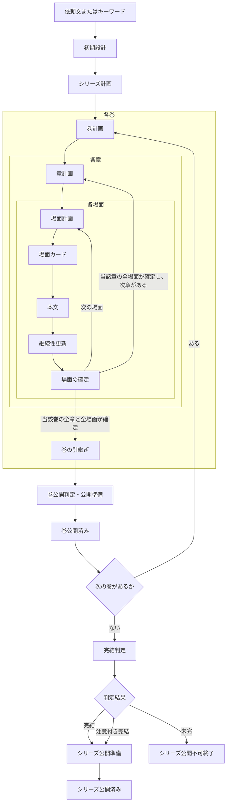

# Storycraft V1 仕様

## 1. この文書の役割

この文書は Storycraft V1 の唯一の仕様正本です。製品が満たすべき振る舞い、保存する成果物、品質、復旧、公開の目標契約を定めます。この文書は、現行実装が全契約をすでに満たすことを意味しません。契約との差分は[実装状況](IMPLEMENTATION_STATUS.md)に時点付きで記録します。

対象読者は利用者、実装担当者、試験担当者です。画面、コマンド、JSON の細部は実装に合わせて更新できますが、この文書の契約を弱めてはなりません。

## 2. 目的と範囲

Storycraft は、依頼文またはキーワードから日本語の長編シリーズを設計・執筆し、継続性を管理して公開用 Markdown 原稿を作るローカル実行型のコマンドラインツールです。

V1 は、日本語で 4〜10 巻の作品を、一人の利用者が一つのローカル作業場所で作ることを前提とします。LLM は物語の生成と意味的な評価に使います。新規実行 `run`、再開 `resume`、一工程実行 `step`、状態表示 `status`、検証 `validate` を提供します。

複数人の同時編集、分散実行、外部作業場所、自動ウェブ検索、他会話の記憶取得、Git を実行状態の正本にすること、公開時の本文再生成は対象外です。

## 3. 入力と操作

新規作品は、依頼文またはキーワードの**正確に一方**から始めます。両方指定、未指定、巻数範囲外、必須条件と避ける条件の明示的な矛盾は拒否します。

依頼文には題名、ジャンル、前提、必須要素、避ける条件、結末の希望、巻数、言語を含めます。キーワードから依頼文を作るときは、明示条件を保った候補を作り、形式検証と独立した LLM 確認を必ず行います。確認では、前提、結末の希望、避ける条件、必須要素、日本語品質の取り違えを検査します。

- `run`: 新しい作業場所を作り、停止・失敗・完了まで実行する。
- `resume`: 保存済みの作業場所を検証・復旧してから再開する。
- `step`: 必要な復旧を先に行い、次の一工程だけを実行する。
- `status`: 状態を変更せずに表示する。
- `validate`: 作業場所全体を変更せずに検証する。

## 4. 正本、保存、実行状態

各情報には正本を一つだけ持ちます。

| 情報 | 正本 |
|---|---|
| 作品の事実、人物、関係、世界、未解決事項、知識、時系列の現在値 | 確定済みの作品状態 |
| 実行位置、停止理由、現在の作品状態、巻別・シリーズ別の公開記録、保留中の確定 | 実行状態 |
| 物語構造と次の作業の意図 | 採用済み計画と場面カード |
| 読者向け出力 | 巻別またはシリーズ別に確定した公開用原稿 |
| LLM 呼出しの設定、入出力、利用量、失敗 | 呼出し記録 |

計画は予定であり、事実ではありません。計画と場面カードは版ごとに不変です。実行状態は、シリーズ、巻、章、場面の各論理位置について、現在採用している版を一つだけ参照します。置き換えられた版は履歴として残しますが、完結判定の対象にはしません。完結判定は、現在採用している計画版の未完了作業だけを対象にします。本文中の根拠がない限り、作品の事実、現在状態、知識、未解決事項を更新してはなりません。巻の引継ぎ、入力用の要約、確認、修正は補助成果物であり、作品状態を上書きしません。呼出し記録は LLM 呼出しだけの正本であり、物語、実行状態、公開用原稿の正本ではありません。

確定済みの作品状態、場面、計画、巻の引継ぎ、完結判定、巻別・シリーズ別の公開用原稿は不変です。一つの変更可能なファイルは内容全体を置き換え、複数ファイルの成果物は一時保存場所を完成させてからまとめて確定します。途中成果物を正本として見せず、既存の確定成果物を上書きしません。

実行状態には、工程状態、停止理由、現在の作品状態、巻別・シリーズ別の公開記録、保留中の確定、完結判定結果を別々に保存します。完結判定結果は実行状態そのものではありません。

| 工程状態 | 許可されること | 終了または次の状態 |
|---|---|---|
| 作業中 | 次の工程、検証、確定、復旧、巻公開 | シリーズ完結判定、予算待ち、人手確認待ち |
| 予算待ち | 検証、確定、コードだけで行える復旧 | 予算追加後に保存済み工程から作業中へ戻る |
| 人手確認待ち | 表示、検証、解決記録の登録 | 検証済みの解決記録後に、保存済みの安全な工程へ戻る |
| シリーズ完結判定準備完了 | シリーズ完結判定とその確認 | シリーズ公開準備、シリーズ公開不可終了、予算待ち、人手確認待ち |
| シリーズ公開準備 | シリーズ公開用原稿の組立、検証、確定 | シリーズ公開済み、人手確認待ち |
| シリーズ公開済み | 表示、検証 | 終了 |
| シリーズ公開不可終了 | 表示、検証 | 終了。実行状態では `blocked` と停止理由 `completion_incomplete` で記録する。既に公開済みの巻は取り消さない |

この表はシリーズ全体の工程状態です。巻公開は、巻の引継ぎ後に作る独立した不変成果物であり、巻公開済みになるまで次巻またはシリーズ完結判定へ進みません。実行状態の停止値は `blocked` です。予算待ち、人手確認待ち、シリーズ公開不可終了は、ともに `blocked` と停止理由の組で表します。予算待ちの停止理由は `budget_exhausted`、人手確認待ちの停止理由は `manual_review_required`、シリーズ公開不可終了の停止理由は `completion_incomplete` です。品質の修正上限に達した候補は、最後の形式上有効な版を注意付きで採用します。これらは操作名ではなく停止状態です。再開 `resume`、作り直し `regenerate`、一工程実行 `step` は操作名であり、完結判定の結果とは別です。

## 5. 制作工程

工程は次の順序で進みます。巻、章、場面の数は計画の範囲内で変えられます。

この図は通常の制作順だけを表します。予算待ち、人手確認待ち、停止からの復旧、完結判定と公開の失敗時の遷移は、第4節、第8節、第9節、第10節に従います。

初期設計は、作品の核、人物、関係、世界、知識、未解決事項、結末を整合させ、最初の作品状態として確定します。計画はシリーズ、巻、章、場面の順で作り、各計画は基準となる作品状態を明示します。

場面カードは、本文執筆の局所的な制約、視点、許可された更新、開示制約を持ちます。作品状態は、作者だけが知る情報、人物ごとの知識、読者に開示済みの情報を別々に持ちます。場面本文はカードと固定した基準作品状態に従います。継続性更新は本文の根拠を引用し、カードで許可された可視性更新だけを提案します。場面の確定は本文、検証済み更新、新しい作品状態を一つの単位として扱います。

巻の完了後、巻の引継ぎは、確定した場面、作品状態、計画、根拠に基づき LLM が作る意味的な補助要約です。コードは参照先を検証し、LLM は重要事項の脱落、誤帰属、根拠のない追加を検査します。次巻計画は引継ぎを補助として使えますが、事実は必ず作品状態から読みます。

## 6. LLM による確認と修正

LLM は創作、意味的な要約、物語品質、矛盾、欠落、誤帰属の評価を担当します。識別子、形式、列挙値、参照先の実在、状態遷移、保存、まとめての確定、復旧、公開は決定的なコードが担当します。

作品工程で採用する LLM 生成物、要約、完結判定は、次の四段階を満たします。確認記録、呼出し記録、解決記録そのものには、この品質ループを適用しません。

1. LLM が生成または要約する。
2. コードが生成物の形式、必須項目、識別子、参照、更新可能範囲を検証した後、独立した LLM が確認する。確認結果もコードが形式、必須項目、識別子、参照、根拠位置を検証する。
3. 重大な指摘がなければ採用する。重大な指摘があっても修正回数の上限に達していれば、最後の形式上有効な生成物を注意付きで採用して次工程へ進む。
4. 上限に達していない重大な指摘があれば、LLM が指摘を踏まえて修正する。修正出力は 1 と同じ成果物形式にし、2 へ戻る。

生成、確認、修正の各 LLM 応答は、対応する形式、必須項目、識別子、参照、根拠位置を検証します。不正な応答は採用も確認結果としての利用もしません。呼出しごとにシード値を変えて再呼出しし、最初の呼出しを含め固定5回まで試みます。5回とも不正なら `blocked` と停止理由 `manual_review_required` にし、採用、公開、次工程への進行をしません。確認は生成物を書き換えません。修正は生成物全体を置き換えられます。指摘は優先して直すべき問題を示しますが、修正可能範囲を制限しません。全体の整合性または品質改善のため、指摘対象外も変更できます。ただし、形式、必須項目、識別子、参照、更新可能範囲の契約は必ず守り、独立した LLM 確認は修正版全体を評価します。指摘の重要度は、上限前は修正対象となる「重大」、採用は止めない「注意」、参考情報の「参考」の三つです。修正上限に達して採用する重大な指摘は、注意付き採用の根拠として記録します。LLM が重要度を提案し、コードは値と根拠位置を検証します。解決できない根拠位置を持つ指摘は無効として除外し、修正入力にも重大判定にも使いません。確定済み成果物を、別結果を探すために作り直してはなりません。

## 7. 入力範囲、秘密、要約

各 LLM 操作には、必要な根拠だけを読み取り用入力として渡します。これは正本ではありません。作者用情報、人物が知る情報、読者に開示済みの情報を区別します。本文を書く LLM には、視点外の秘密や未許可の開示を渡さず、LLM 提供者へ認証情報を渡しません。

長い根拠を縮める必要があるときは、元の成果物、範囲、基準作品状態を保持する LLM の意味的な要約を作ります。先頭・末尾の抜粋、固定行数・固定文字数の切り詰め、本文の機械的な連結を要約として使いません。要約も LLM 生成物として確認し、必要なら修正と再確認を受けます。

外部入力はデータとして区切り、命令として実行しません。自動ウェブ取得、外部操作、秘密情報の保存・出力を禁止します。

## 8. LLM 呼出し、失敗、利用量

LLM 提供者は、LLM が必要な工程でだけ初期化します。復旧、状態表示、検証、確定、公開など、コードだけで行える処理には不要です。

通信失敗、時間切れ、形式不正、設定・認証情報の不正、意味上の重大な指摘、内部エラーを区別します。形式不正は第6節の固定5回のシード変更再呼出し対象であり、意味上の重大な指摘は修正対象です。再試行は同じ候補を壊さず、回数、待機、結果を記録します。利用量、トークン、費用、LLM 呼出し数の上限は実行開始時に見積もり、全ての LLM 呼出しに適用します。

予算到達後は新しい LLM 呼出しを開始しません。ただし、既存候補の検証・採用、まとめての確定、状態更新、復旧、安全停止は続けます。復旧に新しい LLM 呼出しが必要なら予算待ちにし、予算追加まで作り直し、再開、一工程実行でその呼出しを始めません。予算節約を理由に必須の確認や修正を省略して採用してはなりません。

## 9. 中断と復旧

作業場所は排他的に操作します。起動時は、実行状態、参照、保留中の確定、一時保存場所、確定済みの保存場所を検証します。

- **再開（`resume`）**: 不足していない安全な次工程から続ける。
- **作り直し（`regenerate`）**: 確定前の不完全な候補だけを作り直す。これは復旧処理の内部操作であり、利用者向けコマンドではない。
- **人手確認待ち**: 正本、参照、確定物の矛盾を検出したため、人間の確認を求める。実行状態では `blocked` と停止理由 `manual_review_required` の組で表す。

復旧は前進型で、確定済み成果物を戻したり上書きしたりしません。場面の確定と公開の途中で停止した場合は、一時保存場所と保留中の確定を使い、同じ成果物を二重確定せず、不要な LLM 呼出しを増やさずに収束します。

予算待ちの作業場所では、再開と一工程実行は必要な検証・コードだけの復旧を進めます。最初に新しい LLM 呼出しが必要な工程で、その工程を実行状態に保持したまま予算待ちにし、予算追加後に同じ工程から再開します。

人手確認待ちを解消できるのは、運用責任者だけです。人手確認は、固定5回の形式不正、または正本・参照・確定物の整合性回復が必要な場合に限ります。修正回数の上限到達や重大な品質指摘は、人手確認待ちの理由にしません。運用責任者は原因、対象、根拠、解決内容、停止直前の安全な工程を持つ不変の解決記録を新たに確定します。既存の作品状態、計画、場面、完結判定を直接書き換えてはなりません。

整合性回復待ちでは、解決記録が相互に整合する不変成果物の組を一つ選び、以後の正本参照先にできます。整合する組を選べない場合はシリーズ公開不可終了とし、既存成果物を上書きして解決してはなりません。

解決記録は旧成果物を参照し、コードが参照、対象範囲、保存の完全性、戻り先の工程を検証します。検証に通った解決記録だけが、実行状態を記録済みの安全な工程へ戻せます。シリーズ完結判定の不整合から戻る場合の安全な工程は、シリーズ完結判定準備完了です。

## 10. 巻公開とシリーズ完結判定

公開には、巻公開とシリーズ完結公開の二種類があります。巻公開は、シリーズ全巻の完成を待ちません。シリーズ完結公開は、全巻の完成とシリーズ全体の完結判定を必要とします。

各巻は、その巻の全ての現行採用計画作業、場面本文、継続性更新、巻の引継ぎが確定した後に巻公開判定を行います。巻公開判定は、採用済みの巻を読者向け原稿へ決定的に組み立てられること、巻・章・場面の順序、公開注意、出力の完全性を検証する関門です。次巻へ残す計画済みの問いや引きは、巻公開を妨げる未完ではありません。品質ループの修正上限で重大な指摘が残った巻は、編集上の注意を付けて公開します。形式不正、必須入力不足、公開注意種別の欠落・不正、または確定失敗なら巻公開を確定せず、`blocked` と停止理由 `manual_review_required` にして次巻の制作へ進みません。巻公開済みになってからだけ、次巻の計画またはシリーズ完結判定へ進みます。

巻公開用原稿は、その巻に属する確定済み場面、巻公開判定、巻の順序から決定的に組み立てます。新しい物語本文や設定を生成せず、作者用情報を含めません。巻、章、場面の順序、巻公開判定との整合、出力の完全性を検証して確定します。公開済みの巻は不変であり、後からシリーズ完結判定が未完になっても取り消しません。

全巻が完了して巻公開済みとなり、必要な未解決事項、結末、物語全体の流れを根拠とともに評価できるときだけ、シリーズ完結判定を実行します。計画版を切り替えるときは、それまでに確定した各場面を新版の対応する作業として必ず参照します。確定済み場面を対応先なしに新版から外してはなりません。必須確認は、全ての現行採用計画版の作業が確定済みであること、現行計画版が確定済み場面を全て参照すること、必須の未解決事項・結末・物語全体の流れごとに根拠参照付きの結論があることです。確認できない必須項目があれば未完です。

完結判定結果は、次の三つです。

| 結果 | 次の工程 | シリーズ完結公開 |
|---|---|---|
| 完結（内部値 `complete`） | シリーズ公開準備へ進む | 可能 |
| 注意付き完結（内部値 `complete_with_issues`） | シリーズ公開準備へ進む | 注意付きで可能 |
| 未完（内部値 `incomplete`） | シリーズ公開不可終了へ進む。自動再開と一工程実行は新しい作品生成を行わない | 不可。巻公開の可否には影響しない |

必須確認が全て通り注意付き採用の記録がなければ完結、必須確認が全て通るが注意または修正上限到達時の重大指摘が記録されていれば注意付き完結、それ以外は未完です。

完結判定の評価、独立確認、修正、採用は第6節の四段階に従います。形式不正は、固定5回のシード変更再呼出しの対象です。予算のため新しい LLM 呼出しを始められない場合は予算待ち、5回とも形式不正なら人手確認待ちにします。修正上限で重大な指摘が残っても、最後の形式上有効な判定を注意付きで採用します。望ましい結果を得るために入力集合や結論を変えて再評価してはなりません。

整合確認が判定結果、必須確認、根拠の不整合を検出した場合、そのシリーズ完結判定は公開せず人手確認待ちにします。運用責任者が前節の解決記録を確定した後だけ、新しい確定済み成果物を根拠に完結判定を実行できます。この再実行は望ましい結果を探すために行ってはなりません。

注意付きの巻公開またはシリーズ完結公開には、公開注意種別を必ず一つ保存します。公開注意種別は「表現」または「編集」だけです。公開上の注意として、それぞれ「表現上の注意があります。」「編集上の注意があります。」を必ず本文冒頭に出力します。注意なしの公開には公開注意種別を保存せず、公開上の注意も出力しません。種別が欠落・不正なら公開を確定せず、`blocked` と停止理由 `manual_review_required` にします。内部の指摘番号、根拠位置、未開示事項、作者用の分析、内部要約は出力してはなりません。コードは許可された定型文以外が含まれる公開用原稿を拒否します。シリーズ完結判定が未完ではシリーズ公開用原稿を作成できず、V1 に手動例外はありません。

## 11. 品質と受入条件

V1 の受入では、少なくとも次を確認します。

- 依頼文とキーワードの入力検証、全工程の正常実行、一工程実行、停止後の再開
- LLM 生成物の形式検証、確認、修正、再確認、根拠と更新範囲の検証
- 日本語本文、視点・開示制約、計画と確定事実の分離
- 不変の成果物、まとめての確定、排他制御、場面・巻公開・シリーズ公開の停止からの復旧
- 巻公開、シリーズ完結判定、シリーズ公開順序、作者用情報の除外、再構築の決定性
- LLM 提供者の失敗、時間切れ、予算、呼出し記録、認証情報の非保存
- 隔離した自動試験、インストール済みコマンドの動作確認、実装状況の時点記録

## 12. 変更管理

仕様変更はこの文書を先に更新し、実装、試験、実装状況、README の順に整合させます。実装状況、レビュー記録、テスト用資料は仕様正本ではありません。新しい正本、状態、保存形式、外部連携を増やす前に、既存契約で表現できない理由と復旧・検証方法を確認します。
