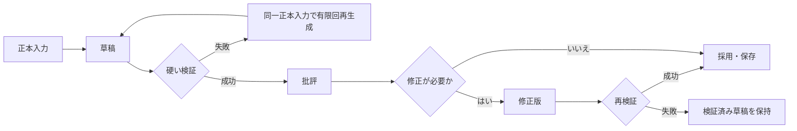

# 次世代実装の設計方針

> 製品上の振る舞いは[製品仕様](../product/SPECIFICATION.md)、工程ごとの所有権とLLM責務は[次世代生成フロー設計](next_generation_flow.md)を正本とする。この文書は、それらを実行可能で再開可能な状態遷移へ落とすための設計契約である。

## 正本状態

正本は次の五種類に分ける。未採用の草稿、批評、修正版は実行記録として残すが、後続工程の入力正本にはしない。

| 正本 | 内容 | 後続工程での扱い |
|---|---|---|
| 企画・全巻構成 | 利用者の希望、巻順、巻の役割、巻末の問い。結末条件の正本は企画の `ending` | 初期確定後は不変 |
| 初期台帳 | 人物、関係、世界、時間、主要項目の固定情報と開始状態 | 固定情報は不変。現在状態だけを場面採用で更新 |
| 巻・章・場面設計 | 未執筆単位の局所目的、開示範囲、許可更新 | 対象単位が未執筆の間だけ修正可能 |
| 場面成果物 | 凍結本文、本文根拠つき要約、採用済み状態更新 | 採用後は不変 |
| 進捗・実行記録 | 完了単位、停止理由、草稿、批評、修正、採用根拠 | 再開判断だけに使う |

## 実行単位と再開

`run` は未完了の実行単位を連続処理する。`step` は次の保存可能な単位を一つだけ処理する。`resume` は企画を再入力せず、保存済みの採用状態だけから未完了単位を続ける。

保存可能な単位は、全巻構成、各初期台帳、初期台帳確定、対象巻の章一覧、対象場面、対象巻の要約、完結確認、Markdown出力である。採用済み単位は再生成しない。

旧保存形式の読込、変換、互換shimは作らない。新しい正本契約を満たさない保存状態は停止理由を示して拒否する。

## 共通の採用ライフサイクル

LLMが内容を生成する工程は、次の順序を守る。

- 硬い検証に失敗した候補は採用しない。
- 再生成回数には上限を持たせ、上限到達時は保存済み状態を残して停止する。
- 批評と修正は、検証済み草稿が存在するときだけ行う。
- 批評または修正が失敗しても、検証済み草稿を失わない。
- 品質上の指摘は記録・修正対象にできるが、硬い契約違反と混同しない。

## 場面の原子的採用

場面は一つの採用単位である。ただし、LLM応答は本文と継続性抽出を分ける。

1. 場面カードから、本文に見せてよい情報と更新候補を定める。
2. 本文工程は凍結する完成本文だけを返す。
3. 継続性抽出工程は、凍結本文から要約と状態更新候補を抽出する。
4. コードが本文根拠、対象ID、可視範囲、更新許可、変更可能フィールドを検証する。
5. 本文、要約、状態更新をまとめて採用し、更新済み台帳を次場面へ渡す。

本文だけ、要約だけ、状態更新だけを独立して採用してはならない。検証に失敗した更新を持つ場面は、採用済み場面にも台帳にもならない。

## ID・参照・更新の境界

- 永続IDはコードだけが割り当てる。LLMは新規台帳の内容を返すが、永続IDを決めない。
- 関係、時間、主要項目、場面カードは、入力として提示された既知IDだけを参照する。
- 場面カードの更新許可IDは、同カードの可視IDの部分集合でなければならない。
- 状態更新は、許可された台帳項目の現在状態だけを変更できる。固定情報、作者の真実、回収条件、未許可IDは変更できない。
- 各更新は採用場面IDと、凍結本文中の根拠を持つ。根拠のない更新は拒否する。

## 完結と出力

完結はLLMの自己申告で決めない。出力前にコードが次を確認する。

- 登録済みの主要項目がすべて回収済みである。
- 最終巻の結末条件を裏付ける本文根拠がある。
- 計画された巻・章・場面に空本文や欠落がない。
- 巻本文が重複していない。

すべてを満たしたときだけ、巻別Markdownと全巻Markdownを完成成果物として保存する。

## 最小の受け入れ確認

テストは必要最小限に保つ。決定的なテスト用モデルで、次の契約を代表ケースとして確認する。

| 契約 | 確認すること |
|---|---|
| 初期台帳先行 | 人物・関係・世界・時間・主要項目が章・場面・本文より先に採用される |
| 場面採用 | 本文根拠のない、未知IDの、または未許可の状態更新を拒否する |
| 再開 | 採用済み台帳・場面を再生成せず、保存済み状態から未完了単位を続ける |

障害を修正するときだけ、その障害を再現するテストを追加する。網羅的な工程別テストの増殖は目的にしない。
