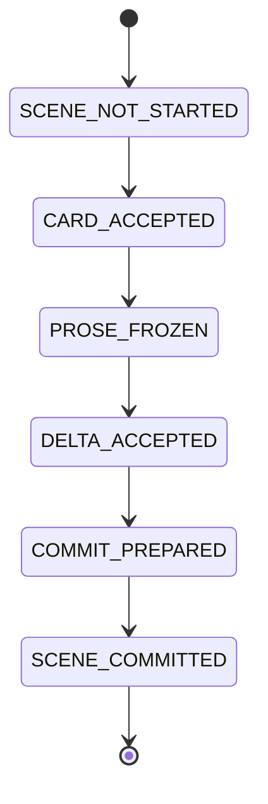

# Runtime and recovery

> Runtime、scene state machine、generation、resume、lockの唯一の正本。pathは[workspace layout](workspace_layout.md)を参照する。

## Scene state machine

| phase | mandatory artifact | resume action |
|---|---|---|
| `SCENE_NOT_STARTED` | none | SC-01 |
| `CARD_ACCEPTED` | card hash | PROSE-01 with same card |
| `PROSE_FROZEN` | card/prose hash | DELTA-01 with same prose |
| `DELTA_ACCEPTED` | card/prose/delta hash | COMMIT-01 |
| `COMMIT_PREPARED` | draft commit manifest | validate/replay same commit ID |
| `SCENE_COMMITTED` | final manifest and HEAD chain | next scene |

Checkpoint has `scene_id,phase,artifact_paths,artifact_hashes,revision_rounds_used,retry_counters,created_at` and rejects missing/hash-mismatched artifacts. Resume never regenerates adopted card, frozen prose, or accepted delta.

## Genesis and commit

INIT-ID creates `canon/generations/00000000/{current-canon.json,story-state.json,knowledge-items.json,evidence-index.jsonl,commit-manifest.json}` then atomically writes `canon/HEAD = 00000000`. Genesis manifest is `commit_id:"commit-00000000", parent_commit_id:null, scene_id:null, commit_type:"initial_design"`. Adopted series map does not create or alter a generation.

For a scene: allocate persisted `commit_id`; build generation and scene artifact in `.staging/scene-commits/<commit-id>/`; validate Schema/ID/hash/evidence/before-after/clock/policy; rename generation; rename artifact; finalize manifest; atomically replace HEAD last; update runtime phase. Manifest fields are `commit_id,parent_commit_id,scene_id,before_generation,after_generation,artifact_hashes,local_key_to_id_mapping,committed_at`. Same commit reuses persisted mapping keyed by `scene_id+local_key+type`.

## Orphan recovery

A generation not in the HEAD parent chain is orphan. A scene artifact whose mandatory `scene-manifest.json.commit_id` is not in that chain is orphan. Resume moves each orphan into `runtime/orphans/<timestamp>/` before deletion is allowed; it never deletes adopted artifacts or a generation reachable from HEAD.

## Run and counter files

`run-manifest.json` has `run_id,state_version,code_version,prompt_bundle_version,schema_bundle_version,config_fingerprint,pricing_table_version,model,editorial_profile_id,publishing_profile_id,created_at`.

`counters.json` has `next_call_id,next_commit_id,next_publication_id,next_character_id,next_relationship_id,next_location_id,next_organization_id,next_item_id,next_system_id,next_rule_id,next_thread_id,next_ending_id,next_fact_id,next_evidence_id,transport_retries_used,response_structure_retries_used,revision_rounds_used,completion_audit_attempts_used,input_tokens_used,output_tokens_used,estimated_cost_used,active_elapsed_seconds`. All counters are non-negative integers except cost (non-negative number).

## Lock

v1 is single-process POSIX. `.storycraft.lock` uses `fcntl` advisory lock and stores `pid,hostname,run_id,started_at`. Stale release is allowed only when same-host PID does not exist. Windows and network filesystems are refused.
