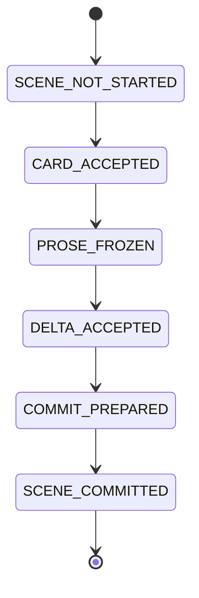

# Runtime and recovery

> Checkpoint・commit・resume・manifest・orphan recoveryの唯一の正本。pathは[workspace layout](workspace_layout.md)、retryは[configuration contracts](configuration_contracts.md)を参照する。

## Scene state machine

| phase | mandatory checkpoint | resume stage |
|---|---|---|
| `SCENE_NOT_STARTED` | none | SC-01 |
| `CARD_ACCEPTED` | card and manifest | PROSE-01 |
| `PROSE_FROZEN` | card/prose and manifest | DELTA-01 |
| `DELTA_ACCEPTED` | card/prose/delta and manifest | COMMIT-01 |
| `COMMIT_PREPARED` | staged commit manifest | COMMIT-01 validation/replay with same commit ID |
| `SCENE_COMMITTED` | final manifest and HEAD chain | next SC-01 |

## Checkpoint manifest

`runtime/checkpoints/scenes/v01/c001/s001/checkpoint-manifest.json` is `additionalProperties:false`.

| field | type | required | nullable | default | creator | mutability | allowed operation | validation | source of truth |
|---|---|---:|---:|---|---|---|---|---|---|
| `scene_id` | scene ID | yes | no | none | code | immutable | none | equals directory | runtime checkpoint |
| `phase` | enum | yes | no | none | code | transition | transition | `CARD_ACCEPTED|PROSE_FROZEN|DELTA_ACCEPTED|COMMIT_PREPARED` | runtime checkpoint |
| `scene_card_path` | relative path | yes | yes | null | code | set | set | exists iff phase after card | runtime checkpoint |
| `scene_card_sha256` | hex string | yes | yes | null | code | set | set | equals path bytes iff non-null | runtime checkpoint |
| `prose_path` | relative path | yes | yes | null | code | set | set | exists iff phase after prose | runtime checkpoint |
| `prose_sha256` | hex string | yes | yes | null | code | set | set | equals prose bytes iff non-null | runtime checkpoint |
| `continuity_delta_path` | relative path | yes | yes | null | code | set | set | exists iff phase after delta | runtime checkpoint |
| `continuity_delta_sha256` | hex string | yes | yes | null | code | set | set | equals path bytes iff non-null | runtime checkpoint |
| `revision_rounds_used` | integer | yes | no | 0 | code | increment | increment | >=0 | runtime checkpoint |
| `transport_retries_used` | integer | yes | no | 0 | code | increment | increment | >=0 | runtime checkpoint |
| `response_structure_retries_used` | integer | yes | no | 0 | code | increment | increment | >=0 | runtime checkpoint |
| `created_at` | RFC3339 timestamp | yes | no | none | code | immutable | none | valid timestamp | runtime checkpoint |
| `updated_at` | RFC3339 timestamp | yes | no | none | code | set | set | >= created_at | runtime checkpoint |

Absent artifact paths and their hashes are `null`; a path/hash pair is never partially null. Resume rejects mismatch and never regenerates an adopted card, frozen prose, or accepted delta.

## Scene and commit manifest

`artifacts/scenes/v01/c001/s001/scene-manifest.json` is written only by COMMIT-04.

| field | type | required | nullable | default | creator | mutability | allowed operation | validation | source of truth |
|---|---|---:|---:|---|---|---|---|---|---|
| `scene_id` | scene ID | yes | no | none | code | immutable | none | directory equality | artifact |
| `commit_id` | commit ID | yes | no | none | code | immutable | none | known commit | artifact |
| `volume_number` | integer | yes | no | none | code | immutable | none | directory v01 | artifact |
| `chapter_number` | integer | yes | no | none | code | immutable | none | directory c001 | artifact |
| `scene_number` | integer | yes | no | none | code | immutable | none | directory s001 | artifact |
| `scene_card_path` | relative path | yes | no | none | code | immutable | none | adopted file | artifact |
| `scene_card_sha256` | hex string | yes | no | none | code | immutable | none | exact bytes | artifact |
| `prose_path` | relative path | yes | no | none | code | immutable | none | adopted file | artifact |
| `prose_sha256` | hex string | yes | no | none | code | immutable | none | exact bytes | artifact |
| `continuity_delta_path` | relative path | yes | no | none | code | immutable | none | adopted file | artifact |
| `continuity_delta_sha256` | hex string | yes | no | none | code | immutable | none | exact bytes | artifact |
| `character_count` | integer | yes | no | none | code | immutable | none | prose codepoint count >=1 | artifact |
| `evidence_ids` | array<string> | yes | no | `[]` | code | immutable | none | evidence index IDs, unique | artifact |
| `input_plan_refs` | array<string> | yes | no | `[]` | code | immutable | none | adopted plan hashes/paths | artifact |
| `adopted_at` | RFC3339 timestamp | yes | no | none | code | immutable | none | valid timestamp | artifact |

Each generation's `commit-manifest.json` is `additionalProperties:false`.

| field | type | required | nullable | default | creator | mutability | allowed operation | validation | source of truth |
|---|---|---:|---:|---|---|---|---|---|---|
| `commit_id` | commit ID | yes | no | none | code | immutable | none | unique counter | generation |
| `commit_type` | enum | yes | no | none | code | immutable | none | `initial_design|scene` | generation |
| `parent_commit_id` | commit ID | yes | yes | null | code | immutable | none | genesis null; else parent | generation |
| `scene_id` | scene ID | yes | yes | null | code | immutable | none | genesis null; else adopted scene | generation |
| `before_generation` | generation ID | yes | yes | null | code | immutable | none | genesis null; else HEAD before | generation |
| `after_generation` | generation ID | yes | no | none | code | immutable | none | directory ID | generation |
| `artifact_hashes` | object | yes | no | `{}` | code | immutable | none | named canonical hashes | generation |
| `local_key_to_id_mapping` | object | yes | no | `{}` | code | immutable | none | stable mapping | generation |
| `created_at` | RFC3339 timestamp | yes | no | none | code | immutable | none | valid timestamp | generation |
| `committed_at` | RFC3339 timestamp | yes | no | none | code | immutable | none | >= created_at | generation |

Genesis is exactly `commit-00000000`, `initial_design`, null parent/scene/before generation, and `after_generation:"00000000"`. INIT-ID first creates generation bytes and manifest, then atomically writes HEAD. Scene commit stages generation and artifact, validates schema/ID/hash/evidence/before-after/clock/policy, renames generation, renames artifact, then replaces HEAD last. Same replay reuses persisted mapping keyed by scene ID, local key, and record type.

## Orphan recovery and runtime files

On resume, a generation not in HEAD parent chain is orphan; a scene artifact whose manifest commit ID is not in that chain is orphan. The process moves it to `runtime/orphans/<timestamp>/`, reconfirms that canonical paths do not reference it, then cleanup policy may remove it. It never deletes an adopted artifact or HEAD-reachable generation.

`counters.json` includes nonnegative `next_call_id,next_commit_id,next_publication_id,next_character_id,next_relationship_id,next_location_id,next_organization_id,next_item_id,next_system_id,next_culture_id,next_history_id,next_rule_id,next_thread_id,next_ending_id,next_fact_id,next_evidence_id`; ID counters allow gaps, never reuse, and are code-only. It also has retry/budget counters.

`run-manifest.json` has `run_id,state_version,code_version,prompt_bundle_version,schema_bundle_version,config_fingerprint,pricing_table_version,model,editorial_profile_id,publishing_profile_id,created_at`. `.storycraft.lock` is a POSIX `fcntl` advisory lock containing `pid,hostname,run_id,started_at`; stale release is only same-host nonexisting PID. Windows and network filesystem are unsupported in v1.
