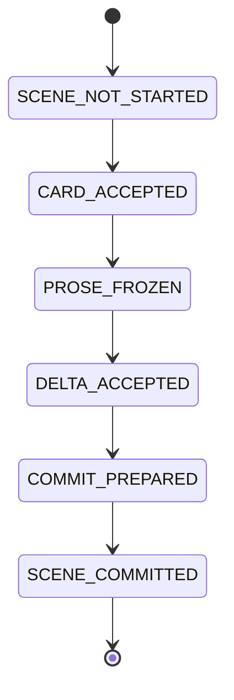

# Runtime and recovery

> runtime、resume、scene commitの正本。保存先は[workspace layout](workspace_layout.md)、台帳は[ledger contracts](ledger_contracts.md)を参照する。v1はPOSIX上の単一プロセスCLIであり、network filesystemとWindowsは非対応。

## 場面状態機械



| 状態 | 必須artifact | resume動作 |
|---|---|---|
| `SCENE_NOT_STARTED` | なし | SC-01から開始 |
| `CARD_ACCEPTED` | scene-card hash | 同じcardでPROSE-01から |
| `PROSE_FROZEN` | card/prose hash | 同じ本文でDELTA-01から |
| `DELTA_ACCEPTED` | card/prose/delta hash | 同じdeltaでCOMMIT-01から |
| `COMMIT_PREPARED` | commit manifest draft | commit状態を確認し、未完なら同じ`commit_id`で再実行 |
| `SCENE_COMMITTED` | final manifestとHEAD参照 | 次場面へ |

checkpoint manifestは`scene_id,phase,artifact_paths,artifact_hashes,revision_rounds_used,retry_counters,created_at`を必須とする。採用済みcard/prose/deltaをresumeで再生成しない。

## generation / HEAD commit

```text
canon/generations/00000042/
├── current-canon.json
├── story-state.json
├── knowledge-items.json
├── evidence-index.jsonl
└── commit-manifest.json
canon/HEAD
```

`commit-manifest.json`は`commit_id,parent_commit_id,scene_id,before_generation,after_generation,artifact_hashes,local_key_to_id_mapping,committed_at`を必須とする。局所ID mappingのkeyは`scene_id + local_key + type`であり、同じcommitの再実行では保存済みmappingを再利用する。

1. `commit_id`を確定する。
2. `.staging/scene-commits/<commit_id>/`へ新generationとscene artifactを構築する。
3. Schema、ID、hash、evidence、before/after、clock、policyを検証する。
4. generation directoryをrenameする。
5. scene artifact directoryをrenameする。
6. manifestを確定する。
7. `canon/HEAD`を最後にatomic replaceする。
8. runtime stateを`SCENE_COMMITTED`へ更新する。

resume時の正本はHEADが参照するgenerationだけである。HEAD未参照generationはorphanであり安全に削除できる。

## lock

`.storycraft.lock`は`fcntl` advisory lockを使う。metadataは`pid,hostname,run_id,started_at`。stale解除は同一hostでPIDが存在しない場合だけ許可し、別host・network filesystemでは解除も実行も拒否する。
