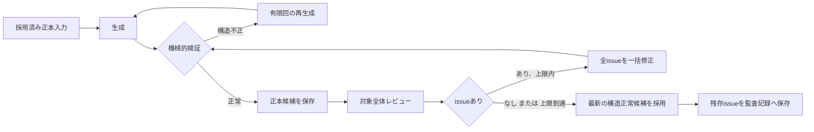

# シリーズエンジン設計方針

> 製品上の正本は[製品仕様](../product/SPECIFICATION.md)、LLM呼び出しの依存関係は[シリーズ生成フロー設計](series_engine_flow.md)とする。この文書は採用、保存、再開、機械的検証を成立させる設計契約である。

## 1. 三つの境界

- **製品フェーズ**は、入力確定から出力までの利用者・システム上の大きな処理単位である。
- **LLM呼び出し**は、フェーズ内部の生成、レビュー、修正、差分抽出、監査という目的限定の操作である。
- **採用・保存単位**は、後続処理の唯一の正本となり、再開可能にする境界である。

一つの製品フェーズに複数のLLM呼び出しを含められる。LLM呼び出しの成功だけでは採用しない。

## 2. 正本候補と採用済み正本

| 区分 | 内容 | 後続工程への使用 |
|---|---|---|
| 正本候補 | 生成または修正後、機械的検証を通った未採用成果物 | レビュー・修正の対象。後続フェーズの入力にはしない |
| 採用済み正本 | 採用操作まで完了したbrief、初期設計bundle、設計、場面、handoff、監査、出力 | 後続工程と再開の正式入力 |
| 実行記録 | 草稿、レビュー、修正、拒否理由、残存issue、raw参照 | 監査と再開診断だけに使う |

Canonは採用済みの固定事実と管理対象項目、現在Stateは場面採用で変わる現在値である。固定事実、作者真実、結末条件、長期`temporal_rules`は本文や差分抽出で上書きできない。

## 3. 共通採用ライフサイクル

- 構造不正は採用せず、同じ採用済み正本入力で有限回再生成する。枯渇時は停止し、既存の採用済み正本を残す。
- レビューは対象成果物全体を対象にする。修正はissueごと・fieldごとではなく、対象全体と全issueを一回の呼び出しで処理する。
- review issueのseverity、合否、継続可能性は停止・採用拒否の条件ではない。上限後には最新の構造正常候補を採用する。
- レビュー呼び出し・レビューJSONの構造異常、修正後の構造不正は機械的に扱う。構造不正の修正版は不採用にし、直前の正本候補を保持する。
- 残存issue、修正回数、対象候補、受容理由を監査記録として保存する。

## 4. 初期設計とID

シリーズ初期設計は、作品コンセプト、人物・関係、世界・時間規則、全体変化・伏線・結末条件、Canon組立、全体レビューという複数呼び出しを含む一つの製品フェーズである。組立前の成果物は正本候補であり、初期設計bundleの採用まで後続フェーズの入力にしない。

LLMは内容を返すが永続IDを決めない。コードが機械的検証後にIDを採番する。後続の候補は採番済み既知IDだけを参照する。時間は、固定・長期の`temporal_rules`と、場面ごとに単調に進む`story_clock`を別に持つ。

## 5. 場面Outer Transaction

場面は一つの外側の原子トランザクションである。

1. 採用済み巻・章設計と現在のCanon・現在Stateから場面カードを採用する。
2. カードとwriter用投影から本文を生成・品質改善し、凍結する。
3. 凍結本文からhandoff、既存項目更新、新規項目提案、knowledge、thread、`story_clock`の差分を抽出・品質改善する。
4. コードが差分を検証し、IDを採番し、Canon・現在Stateへ一括適用する。
5. 本文、handoff、検証済み差分、更新済みCanon・現在State、新規項目、`story_clock`をまとめて採用する。

本文、handoff、差分、State更新の一部だけを採用してはならない。場面カード採用済み、本文凍結済み、差分抽出済みは内部checkpointとして保存できるが、次場面へ渡せる正本はOuter Transaction完了後だけである。

## 6. 差分の機械的検証と適用

コードは少なくとも、Schema、既存ID、許可field、開始Stateとの`before`値、本文evidenceの完全一致、新規項目の許可種別・非重複、`story_clock`の非逆行を検証する。差分抽出LLMはCanonを直接変更しない。

更新では、既存項目更新、新規ID採番、Canon・現在Stateのmerge、人物知識・読者知識、thread状態、`story_clock`、採用場面への来歴を一括で適用する。本文からmajor thread、ending criterion、中心テーマ、作者真実、固定世界規則を自動追加・変更しない。

## 7. 保存・再開・監査

正式な保存・再開単位は、brief、シリーズ初期設計bundle、巻設計、章設計、場面、巻handoff、完結監査、公開出力である。stateは採用済み正本、内部checkpoint、完了単位、停止理由、候補と試行の監査記録を保存する。

保存は、内容全体を耐久化してから原子的に置換する。公開操作は同一作業場所を排他制御し、再開時は採用済み正本から未完了単位を続ける。破損したstate・artifact、保存失敗、置換失敗は停止条件であり、部分採用による回復は行わない。

## 8. 完結と出力

完結監査では、コードが予定成果物、空本文、required major thread、required ending criterionのevidence候補、ID・artifactを確認する。LLMは意味上の裏付けと重要な未解決をレビューする補助であり、完成の自己承認者ではない。LLM issueが残っても、機械的完成条件を満たせば監査記録を残して出力する。

出力は一時領域で検証し、巻別・全巻Markdownと品質監査記録を一体で原子的に公開する。失敗時は既存の完成出力を変更しない。
