# Series engine flow

This document is the normative visual companion to [`series_engine_design.md`](series_engine_design.md).

It visualizes:

- the executable architecture;
- all 50 canonical Stages;
- Candidate, Review, Revision, Checkpoint, Commit, Handoff, Completion, and Publication lifecycles;
- pointer-last adoption;
- source-generation and artifact-authority boundaries;
- `run`, `resume`, and `step`;
- startup reconciliation, quarantine, regeneration, explicit recovery, and manual intervention;
- the distinction between Commit/Generation sequence and Scene order.

The exact Stage registry and transition contract is [`pipeline_contracts.md`](pipeline_contracts.md).

The exact Runtime and crash behavior is [`runtime_and_recovery.md`](runtime_and_recovery.md).

The ledger model is [`ledger_contracts.md`](ledger_contracts.md).

Prompt/Context boundaries are:

- [`prompt_template_design.md`](prompt_template_design.md)
- [`context_contracts.md`](context_contracts.md)

Detailed Stage contracts are:

- [`contracts/pipeline/input_and_initial.md`](contracts/pipeline/input_and_initial.md)
- [`contracts/pipeline/planning.md`](contracts/pipeline/planning.md)
- [`contracts/pipeline/scene_generation.md`](contracts/pipeline/scene_generation.md)
- [`contracts/pipeline/commit_and_output.md`](contracts/pipeline/commit_and_output.md)

The product scope remains in [`../product/SPECIFICATION.md`](../product/SPECIFICATION.md).

---

## 1. Reading conventions

Diagram conventions:

```text
rounded rectangle:
  canonical Stage or service

cylinder/database shape:
  durable authority

hexagon/diamond:
  validated decision

dashed edge:
  read/reference only

solid edge:
  execution or durable transition

HEAD:
  story adoption pointer

CURRENT:
  Publication adoption pointer
```

A diagram arrow does not weaken the exact preconditions in the detailed contracts.

---

## 2. Architecture at a glance

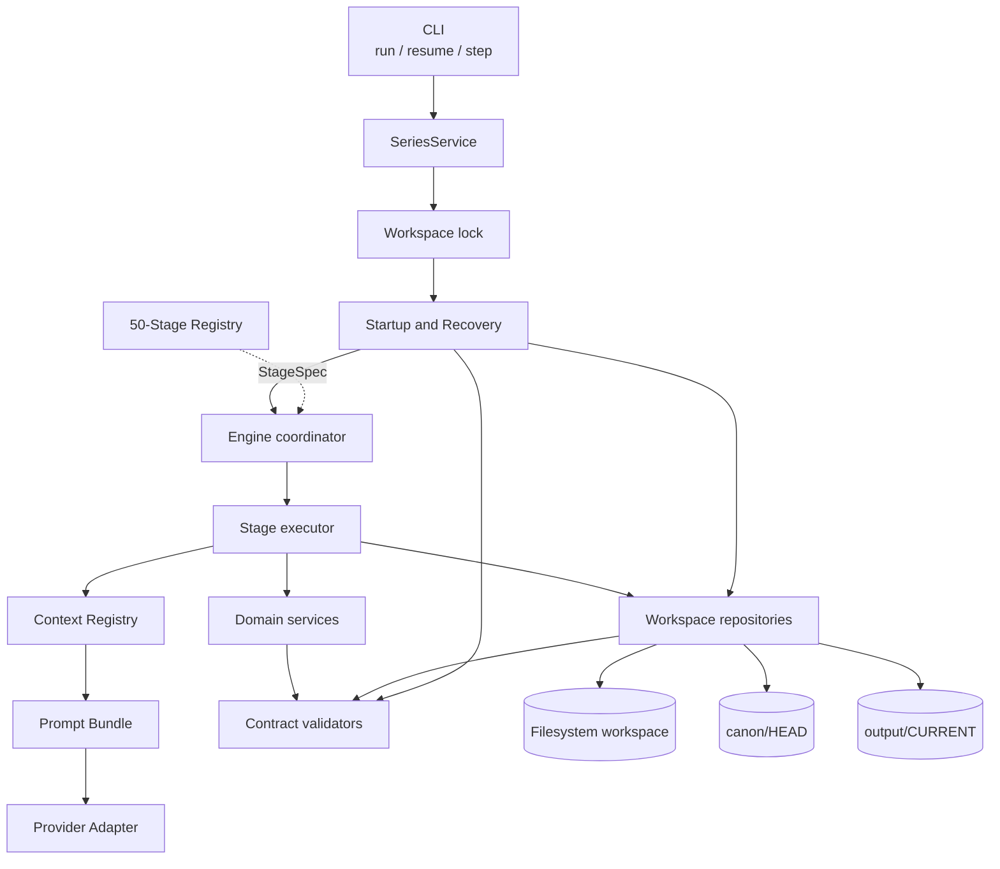

Key rule:

```text
CLI does not select Stages, Schemas, candidates, or pointers.
Engine dispatches only from validated Run state and the canonical Stage registry.
```

---

## 3. Authority hierarchy

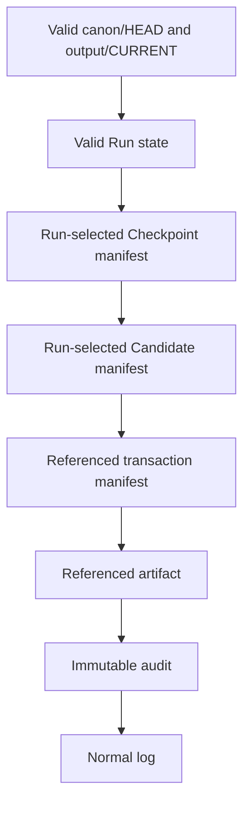

The hierarchy is not a fallback search order for inventing authority.

It means:

```text
a lower layer may support validation
but cannot replace an invalid or absent higher authority
```

---

## 4. Public command flow

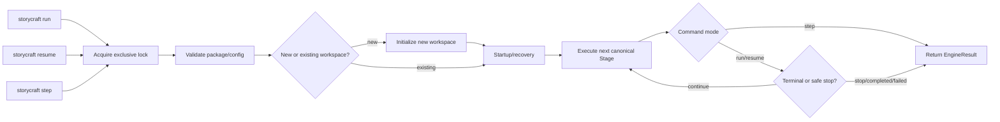

`step` may finish internal retries or one pointer-owning transaction, but it completes at most one canonical Stage.

---

## 5. Canonical Stage inventory

| # | Stage ID | family | processor |
|---:|---|---|---|
| 01 | `INPUT-01` | Input | `code` |
| 02 | `INPUT-02` | Input | `llm_generate` |
| 03 | `INPUT-03` | Input | `code` |
| 04 | `INIT-01` | Initial design | `llm_generate` |
| 05 | `INIT-02` | Initial design | `llm_generate` |
| 06 | `INIT-03` | Initial design | `llm_generate` |
| 07 | `INIT-04` | Initial design | `llm_generate` |
| 08 | `INIT-05` | Initial design | `llm_generate` |
| 09 | `INIT-06` | Initial design | `llm_review` |
| 10 | `INIT-REV` | Initial design | `llm_revise` |
| 11 | `INIT-ID` | Initial design | `code` |
| 12 | `SERIES-01` | Planning | `llm_generate` |
| 13 | `SERIES-02` | Planning | `llm_review` |
| 14 | `SERIES-REV` | Planning | `llm_revise` |
| 15 | `SERIES-ID` | Planning | `code` |
| 16 | `VOL-01` | Planning | `llm_generate` |
| 17 | `VOL-02` | Planning | `llm_review` |
| 18 | `VOL-REV` | Planning | `llm_revise` |
| 19 | `VOL-ID` | Planning | `code` |
| 20 | `CH-01` | Planning | `llm_generate` |
| 21 | `CH-02` | Planning | `llm_review` |
| 22 | `CH-REV` | Planning | `llm_revise` |
| 23 | `CH-ID` | Planning | `code` |
| 24 | `SC-01` | Scene generation | `llm_generate` |
| 25 | `SC-02` | Scene generation | `llm_review` |
| 26 | `SC-REV` | Scene generation | `llm_revise` |
| 27 | `SC-CHK` | Scene generation | `code` |
| 28 | `PROSE-01` | Scene generation | `llm_generate` |
| 29 | `PROSE-02` | Scene generation | `llm_review` |
| 30 | `PROSE-REV` | Scene generation | `llm_revise` |
| 31 | `PROSE-CHK` | Scene generation | `code` |
| 32 | `DELTA-01` | Scene generation | `llm_extract` |
| 33 | `DELTA-02` | Scene generation | `llm_review` |
| 34 | `DELTA-REV` | Scene generation | `llm_revise` |
| 35 | `DELTA-CHK` | Scene generation | `code` |
| 36 | `COMMIT-01` | Scene commit | `code` |
| 37 | `COMMIT-02` | Scene commit | `code` |
| 38 | `COMMIT-03` | Scene commit | `code` |
| 39 | `COMMIT-04` | Scene commit | `code` |
| 40 | `VH-01` | Volume handoff | `llm_generate` |
| 41 | `VH-02` | Volume handoff | `llm_review` |
| 42 | `VH-REV` | Volume handoff | `llm_revise` |
| 43 | `VH-ID` | Volume handoff | `code` |
| 44 | `COMP-PRE` | Completion | `code` |
| 45 | `COMP-AUDIT` | Completion | `llm_generate` |
| 46 | `COMP-SAVE` | Completion | `code` |
| 47 | `OUT-01` | Publication | `code` |
| 48 | `OUT-02` | Publication | `code` |
| 49 | `COMP-PUBLISH` | Publication | `code` |
| 50 | `OUT-03` | Publication | `code` |

Counts:

```text
total Stages: 50
code: 20
llm_generate: 13
llm_extract: 1
llm_review: 8
llm_revise: 8
```

---

# Part I: Complete pipeline

## 6. Full 50-Stage flow

```mermaid
flowchart TB
  START([Start])

  subgraph INPUT["Input — 3"]
    I01["INPUT-01"]
    I02["INPUT-02"]
    I03["INPUT-03"]
    I01 -->|Keywords| I02 --> I03
  end

  subgraph INIT["Initial design — 8"]
    N01["INIT-01"]
    N02["INIT-02"]
    N03["INIT-03"]
    N04["INIT-04"]
    N05["INIT-05"]
    N06["INIT-06"]
    NR["INIT-REV"]
    NID["INIT-ID"]
    N01 --> N02 --> N03 --> N04 --> N05 --> N06
    N06 -->|issues and budget| NR --> N06
    N06 -->|ready or exhausted-valid| NID
  end

  subgraph PLAN["Planning — 12"]
    S01["SERIES-01"]
    S02["SERIES-02"]
    SR["SERIES-REV"]
    SID["SERIES-ID"]
    V01["VOL-01"]
    V02["VOL-02"]
    VR["VOL-REV"]
    VID["VOL-ID"]
    C01["CH-01"]
    C02["CH-02"]
    CR["CH-REV"]
    CID["CH-ID"]

    S01 --> S02
    S02 -->|revise| SR --> S02
    S02 -->|ready| SID --> V01

    V01 --> V02
    V02 -->|revise| VR --> V02
    V02 -->|ready| VID --> C01

    C01 --> C02
    C02 -->|revise| CR --> C02
    C02 -->|ready| CID
  end

  subgraph SCENE["Scene generation — 12"]
    SC1["SC-01"]
    SC2["SC-02"]
    SCR["SC-REV"]
    SCC["SC-CHK"]

    P1["PROSE-01"]
    P2["PROSE-02"]
    PR["PROSE-REV"]
    PC["PROSE-CHK"]

    D1["DELTA-01"]
    D2["DELTA-02"]
    DR["DELTA-REV"]
    DC["DELTA-CHK"]

    SC1 --> SC2
    SC2 -->|revise| SCR --> SC2
    SC2 -->|ready| SCC --> P1

    P1 --> P2
    P2 -->|revise| PR --> P2
    P2 -->|ready| PC --> D1

    D1 --> D2
    D2 -->|revise| DR --> D2
    D2 -->|ready| DC
  end

  subgraph COMMIT["Scene commit — 4"]
    M1["COMMIT-01"]
    M2["COMMIT-02"]
    M3["COMMIT-03"]
    M4["COMMIT-04"]
    M1 --> M2 --> M3 --> M4
  end

  subgraph HANDOFF["Volume Handoff — 4"]
    H1["VH-01"]
    H2["VH-02"]
    HR["VH-REV"]
    HID["VH-ID"]
    H1 --> H2
    H2 -->|revise| HR --> H2
    H2 -->|ready| HID
  end

  subgraph COMPLETE["Completion — 3"]
    CP["COMP-PRE"]
    CA["COMP-AUDIT"]
    CS["COMP-SAVE"]
    CP --> CA --> CS
  end

  subgraph PUB["Publication — 4"]
    O1["OUT-01"]
    O2["OUT-02"]
    G["COMP-PUBLISH"]
    O3["OUT-03"]
    O1 --> O2 --> G
    G -->|Gate pass| O3
  end

  DONE([Completed])
  MANUAL([Terminal stop or manual intervention])

  START --> I01
  I01 -->|Brief| N01
  I03 --> N01
  NID --> S01
  CID --> SC1
  DC --> M1

  M4 -->|next Scene| SC1
  M4 -->|next Chapter| C01
  M4 -->|Volume complete| H1

  HID -->|next Volume| V01
  HID -->|final Volume| CP

  CS --> O1
  G -->|Gate fail| MANUAL
  O3 --> DONE
```

Runtime follows edges, not the numerical order in the registry.

---

## 7. Family progression

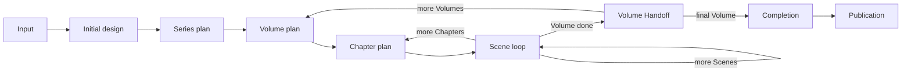

Planning is immutable after adoption.

Later divergence is represented by adopted Scene effects, Handoffs, residual issues, and Completion—not by rewriting plans.

---

## 8. Input branch

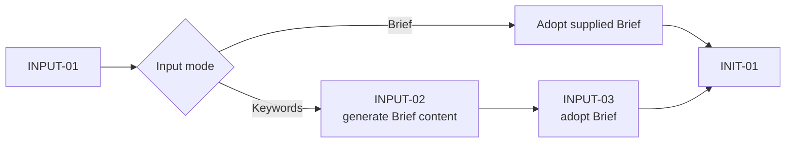

Exactly one input mode is allowed.

---

## 9. Initial-design flow

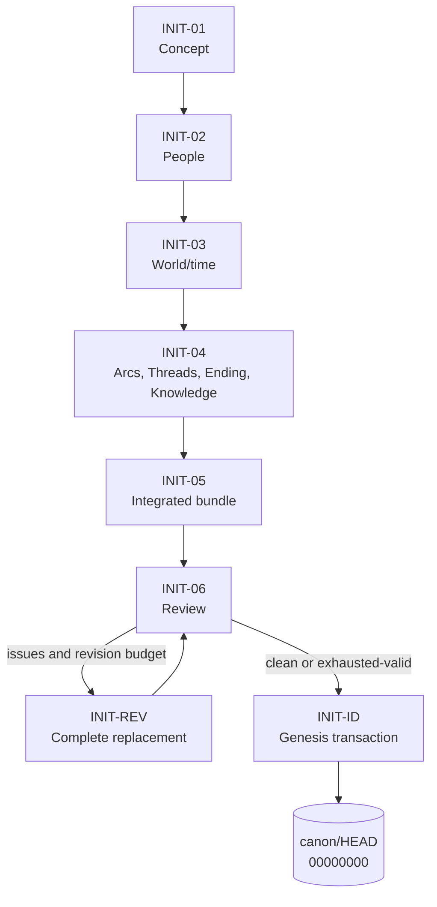

INIT-01 through INIT-04 use distinct response roots.

INIT-ID is the first story-ledger adoption.

---

## 10. Planning flow

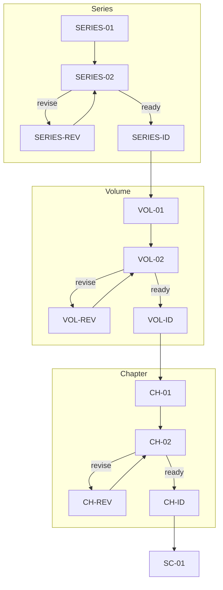

Adopted plan files have no pointer.

Their exact final paths and source/parent hashes provide identity.

---

# Part II: Candidate and Review lifecycle

## 11. Generic LLM candidate loop

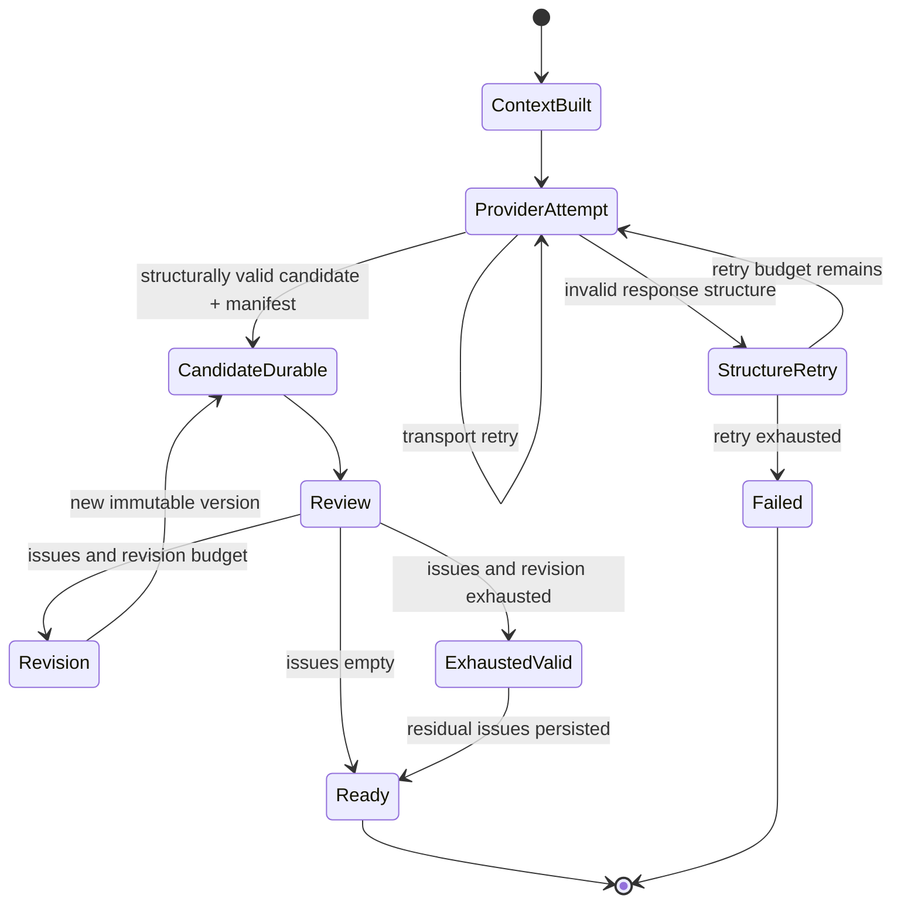

Transport, response structure, and semantic Revision are separate counters.

---

## 12. Candidate authority

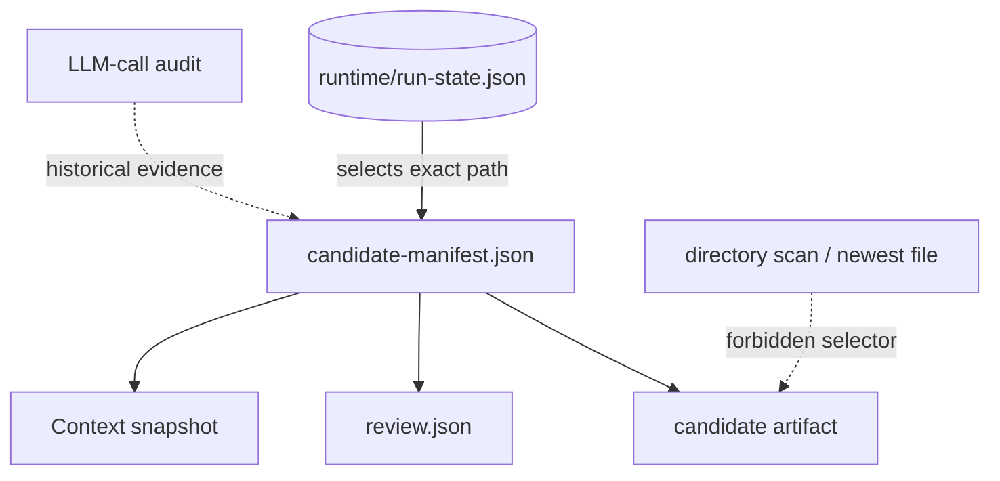

A candidate file without a valid selected manifest is not resumable authority.

A successful audit response is never promoted into a candidate.

---

## 13. Candidate versioning

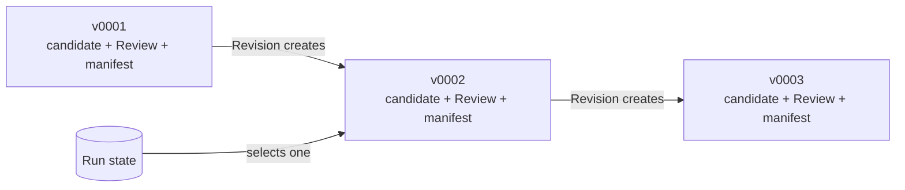

Previous versions remain immutable history.

A Revision returns the complete replacement artifact, not a patch.

---

## 14. Review boundary

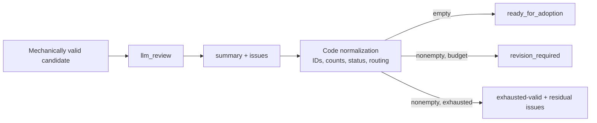

Review never returns:

```text
corrected candidate
next_stage
approval flag
adoption instruction
```

---

## 15. Completion is not the generic Review loop

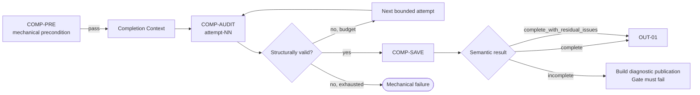

A valid `incomplete` result is not retried to obtain `complete`.

---

# Part III: Scene lifecycle

## 16. One Scene uses one fixed source Generation

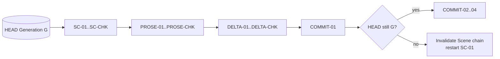

No Scene candidate or checkpoint is rebased onto a different HEAD.

---

## 17. Scene-card lifecycle

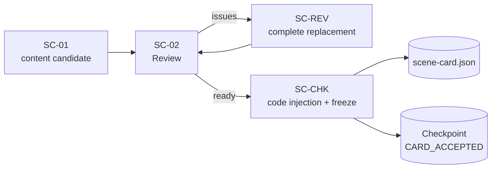

SC-CHK injects:

```text
Scene identity
source/plan hashes
starting Thread/Knowledge values
allowed_update_targets
safe forbidden disclosures
new-item policy limits
length guidance
timestamp
```

---

## 18. Writer-safe prose lifecycle

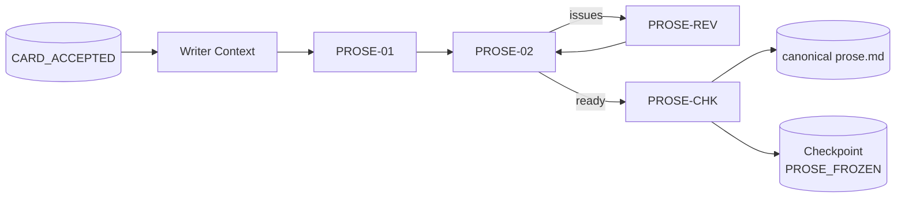

Writer Context excludes private author truth and update mechanics.

---

## 19. Continuity lifecycle

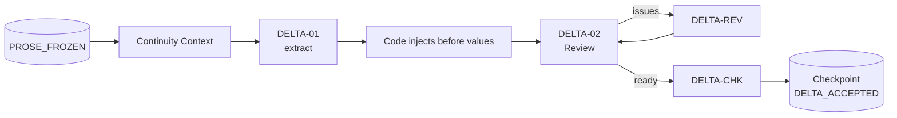

The provider does not allocate:

```text
persistent IDs
Evidence IDs
offsets
hashes
Commit/Generation IDs
timestamps
```

---

## 20. Checkpoint phase authority

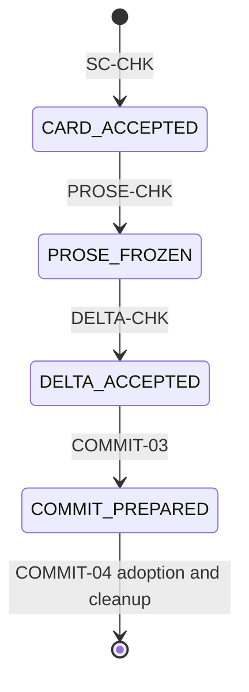

File presence does not advance the phase.

A later-phase file not referenced by the matching manifest is quarantined or ignored according to recovery rules.

---

## 21. Scene data boundary

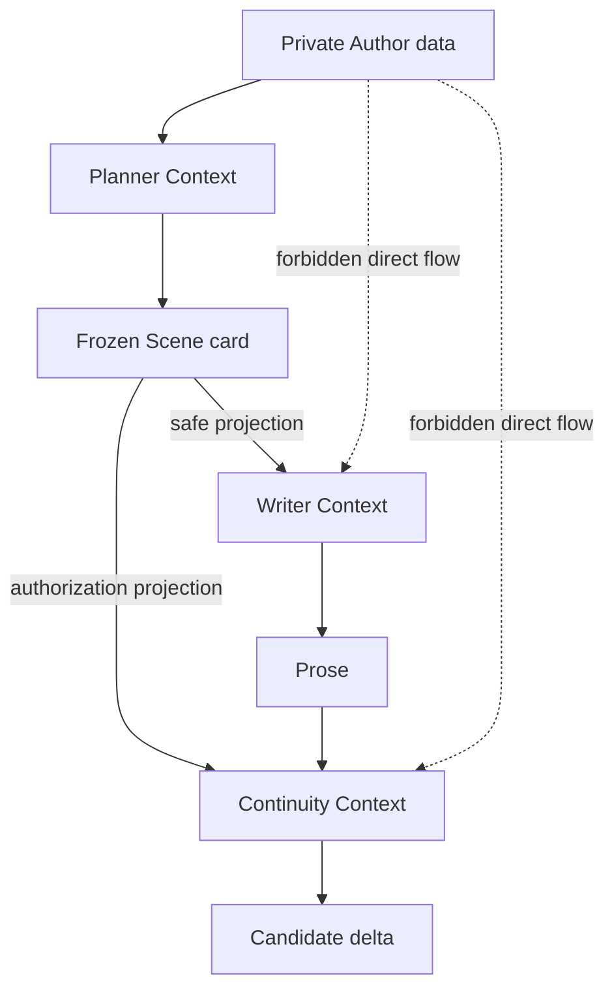

Private Thread/Knowledge/Ending truth may inform planning and private Review, but not Writer/Continuity views.

---

# Part IV: Scene commit

## 22. Four-stage Scene commit

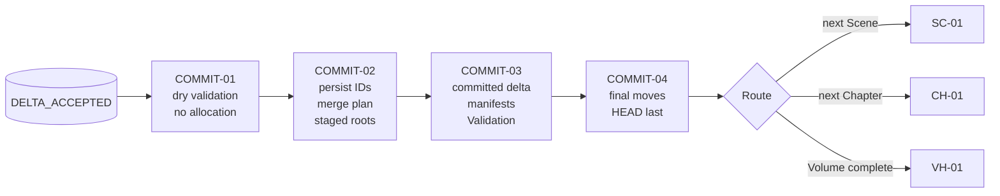

---

## 23. COMMIT-01 boundary

```mermaid
flowchart TB
  INPUT["Frozen card + prose + candidate delta"]
  HEAD[("Current HEAD")]
  VALID["Validate source, authorization,<br/>before values, quotes, route"]
  PLAN[("commit-plan.json")]
  COUNTERS[("runtime/counters.json")]

  INPUT --> VALID
  HEAD --> VALID
  VALID --> PLAN
  COUNTERS -. unchanged .-> PLAN
```

COMMIT-01 creates deterministic allocation requests but consumes no ID.

---

## 24. COMMIT-02 allocation boundary

```mermaid
sequenceDiagram
  participant C as COMMIT-02
  participant K as CounterService
  participant M as MergeService
  participant S as Staging

  C->>K: validate current counters
  C->>K: persist Commit/record/Evidence allocations
  K-->>C: allocated immutable IDs
  C->>M: parent roots + frozen artifacts + allocations
  M-->>C: merge plan + after roots + Evidence mappings
  C->>S: write merge plan and staged roots
```

Allocated gaps remain consumed after a later failure.

---

## 25. COMMIT-03 manifest order

```mermaid
flowchart LR
  CARD["Frozen Scene card"]
  PROSE["Frozen prose"]
  DELTA["Committed delta"]
  ROOTS["After roots"]
  SM["Scene manifest"]
  CM["Commit manifest"]
  GM["Generation manifest"]
  VAL["Transaction Validation"]
  CHK[("COMMIT_PREPARED")]

  CARD --> SM
  PROSE --> SM
  DELTA --> SM
  ROOTS --> CM
  SM --> CM
  CM --> GM
  SM --> GM
  ROOTS --> GM
  GM --> VAL
  VAL --> CHK
```

There is no manifest self-hash cycle.

---

## 26. COMMIT-04 pointer-last adoption

```mermaid
sequenceDiagram
  participant C as COMMIT-04
  participant ST as Staging
  participant GEN as canon/generations/G
  participant SC as artifacts/scenes/...
  participant H as canon/HEAD
  participant R as Run state

  C->>ST: validate COMMIT_PREPARED graph
  C->>GEN: rename Generation to final path
  C->>SC: rename Scene to final path
  C->>GEN: revalidate final Generation
  C->>SC: revalidate final Scene
  C->>H: atomic replace with G
  C->>R: route to next Stage
```

Before the HEAD replacement, final-looking directories remain unadopted.

---

## 27. Delta/root correspondence

```mermaid
flowchart LR
  PARENT["Parent roots"]
  DELTA["Committed continuity delta"]
  CHILD["Child roots"]
  FORWARD["Every delta change appears in child"]
  REVERSE["Every parent→child change appears in delta"]

  PARENT --> FORWARD
  DELTA --> FORWARD --> CHILD
  PARENT --> REVERSE
  CHILD --> REVERSE
  DELTA --> REVERSE
```

Both directions must pass before adoption.

---

## 28. Evidence construction

```mermaid
flowchart LR
  QUOTE["Literal unique prose quote"]
  OFF["Code-point offsets"]
  HASH["quote/prose SHA-256"]
  ID["Persisted Evidence ID"]
  REC["Evidence record"]
  INDEX["Child evidence-index.json"]
  DELTA["Committed delta evidence_ids"]

  QUOTE --> OFF --> HASH
  ID --> REC
  HASH --> REC --> INDEX
  ID --> DELTA
```

Publication-generated text is never Scene Evidence.

---

# Part V: Volume Handoff and order

## 29. Volume Handoff flow

```mermaid
flowchart LR
  LAST[("Final Scene HEAD of Volume")]
  V1["VH-01"]
  V2["VH-02"]
  VR["VH-REV"]
  VID["VH-ID"]
  H[("artifacts/handoffs/vNN.json")]
  HEAD[("New Handoff HEAD")]
  ROUTE{"Final Volume?"}

  LAST --> V1 --> V2
  V2 -->|issues| VR --> V2
  V2 -->|ready| VID
  VID --> H
  VID --> HEAD --> ROUTE
  ROUTE -->|no| VOL["VOL-01"]
  ROUTE -->|yes| COMP["COMP-PRE"]
```

---

## 30. Handoff root-change boundary

```mermaid
flowchart TB
  P["Parent Generation"]
  C["Child Handoff Generation"]

  P1["current-canon.json"]
  P2["knowledge-items.json"]
  P3["story-state.json"]
  P4["evidence-index.json"]

  C1["current-canon.json<br/>byte-identical"]
  C2["knowledge-items.json<br/>byte-identical"]
  C3["story-state.json<br/>only volume_disposition"]
  C4["evidence-index.json<br/>byte-identical"]

  P --> P1
  P --> P2
  P --> P3
  P --> P4

  P1 --> C1 --> C
  P2 --> C2 --> C
  P3 --> C3 --> C
  P4 --> C4 --> C
```

The complete Story clock is byte/logically identical across a Handoff commit.

---

## 31. Generation ID is not Scene order

```mermaid
flowchart LR
  G0["Genesis<br/>Generation 0<br/>order 0"]
  S1["Scene commit<br/>Generation +1<br/>order +1"]
  H1["Handoff commit<br/>Generation +1<br/>order unchanged"]
  SN["Next Scene<br/>Generation +1<br/>order +1"]

  G0 --> S1 --> H1 --> SN
```

Canonical final fixture:

```text
47 Scene commits
4 Handoff commits
final Generation = 00000051
final Story-clock current_order = 47
```

---

# Part VI: Completion and Publication

## 32. Noncyclic Completion identity

```mermaid
flowchart LR
  PRE["Completion precondition"]
  PREH["precondition SHA-256"]
  CTX["Completion Context<br/>includes precondition"]
  CTXH["Context SHA-256"]
  ATT["saved attempt<br/>refers to both hashes"]
  AUD["accepted private Completion audit"]

  PRE --> PREH --> CTX --> CTXH --> ATT --> AUD
```

The precondition must not contain the Context hash.

---

## 33. Completion decision

```mermaid
flowchart TB
  AUD["Accepted private Completion audit"]
  RESULT{"overall_assessment"}
  COMPLETE["complete"]
  RESID["complete_with_residual_issues"]
  INC["incomplete"]
  BUILD["OUT-01 / OUT-02"]
  GATE["COMP-PUBLISH"]
  PASS["Gate pass"]
  FAIL["Gate fail<br/>manual intervention"]

  AUD --> RESULT
  RESULT --> COMPLETE --> BUILD
  RESULT --> RESID --> BUILD
  RESULT --> INC --> BUILD
  BUILD --> GATE
  GATE -->|complete or residual + mechanical pass| PASS
  GATE -->|incomplete or mechanical fail| FAIL
```

Diagnostic publication construction does not mean publication adoption.

---

## 34. Publication hash order

```mermaid
flowchart LR
  PAY["Payload files"]
  PS["payload_set_sha256"]
  VAL["publication-validation.json"]
  VR["Validation file reference"]
  FILES["Manifest.files<br/>payload + Validation"]
  CS["content_set_sha256"]
  MAN["publication-manifest.json"]
  SNAP["publication_snapshot_sha256"]
  GATE["External Publication Gate"]

  PAY --> PS --> VAL --> VR --> FILES --> CS --> MAN --> SNAP --> GATE
```

Excluded from payload set:

```text
Publication Validation
Publication Manifest
provisional build manifest
```

Final Manifest lists Validation but not itself.

---

## 35. Publication Stage flow

```mermaid
flowchart LR
  A["COMP-SAVE"]
  O1["OUT-01<br/>allocate ID<br/>payload + build manifest"]
  O2["OUT-02<br/>Validation + final Manifest<br/>remove build manifest"]
  G["COMP-PUBLISH<br/>external Gate"]
  DEC{"Gate status"}
  O3["OUT-03<br/>rename/revalidate/CURRENT"]
  DONE["completed"]
  STOP["terminal manual stop"]

  A --> O1 --> O2 --> G --> DEC
  DEC -->|pass| O3 --> DONE
  DEC -->|fail| STOP
```

COMP-PUBLISH does not rename a directory and does not change CURRENT.

---

## 36. OUT-03 normal adoption

```mermaid
sequenceDiagram
  participant O as OUT-03
  participant S as .staging/publication/id
  participant G as Publication Gate
  participant F as publications/id
  participant C as output/CURRENT
  participant R as Run state

  O->>S: validate finalized staged root
  O->>G: validate Gate and snapshot
  O->>F: rename staging root
  O->>F: recalculate same root-relative snapshot
  O->>G: revalidate snapshot equality
  O->>C: atomic replace with publication ID
  O->>R: mark completed
```

The Gate stores root-relative internal paths, not staging/final root prefixes.

---

## 37. OUT-03 explicit post-rename recovery

```mermaid
flowchart TB
  CRASH["Crash after publication rename<br/>before CURRENT"]
  GATE[("Original passing Gate")]
  FINAL[("publications/id")]
  STAGE[(".staging/publication/id")]
  CHECK{"Exactly one selected root?"}
  VALID["Validate Manifest, Validation,<br/>payload/content/snapshot hashes"]
  CURRENT["Replace output/CURRENT"]
  DONE["Reconcile completed"]

  CRASH --> GATE
  CRASH --> FINAL
  CRASH --> STAGE
  GATE --> CHECK
  FINAL --> CHECK
  STAGE --> CHECK
  CHECK -->|final exists, staging absent| VALID --> CURRENT --> DONE
  CHECK -->|both or neither| MANUAL["Manual intervention"]
```

This is the only registered adoption recovery that uses a final root after rename.

It still requires the original exact Gate and transaction identity.

---

# Part VII: Runtime and recovery

## 38. Startup validation order

```mermaid
flowchart TB
  LOCK["Acquire lock"]
  SEC["Filesystem security preflight"]
  ROOT["Validate Run manifest, config, counters, Run state"]
  HEAD{"canon/HEAD present?"}
  HVALID["Validate complete HEAD graph"]
  CUR{"output/CURRENT present?"}
  CVALID["Validate complete CURRENT graph"]
  RECON["Reconcile Run state from pointers"]
  CHK["Validate Run-selected Checkpoint"]
  CAND["Validate Run-selected Candidate"]
  TXN["Validate referenced transaction"]
  ORPH["Classify unreferenced content"]
  POS["Return ExecutionPosition"]

  LOCK --> SEC --> ROOT --> HEAD
  HEAD -->|yes| HVALID --> CUR
  HEAD -->|no and pre-Genesis| CUR
  CUR -->|yes| CVALID --> RECON
  CUR -->|no| RECON
  RECON --> CHK --> CAND --> TXN --> ORPH --> POS
```

Orphan scanning happens after authoritative pointer/Run/candidate/checkpoint validation.

---

## 39. Recovery action classes

```mermaid
flowchart LR
  DURABLE["Observed durable state"]
  CLASS{"Classifier"}
  REC["reconcile"]
  RES["resume"]
  REG["regenerate"]
  Q["quarantine"]
  EXP["explicit_recovery"]
  MAN["manual_intervention"]

  DURABLE --> CLASS
  CLASS --> REC
  CLASS --> RES
  CLASS --> REG
  CLASS --> Q
  CLASS --> EXP
  CLASS --> MAN
```

Recovery classification itself does not mutate story meaning.

---

## 40. Candidate recovery matrix

| durable state | action |
|---|---|
| candidate + valid selected Candidate manifest | resume or reconcile |
| candidate file only | quarantine and regenerate |
| Candidate manifest only | quarantine and regenerate |
| successful raw audit only | repeat provider call with new Call ID |
| referenced valid Review | route without repeating Review |
| unreferenced Review | do not promote; repeat Review |
| stale source Generation | invalidate chain and regenerate |
| highest/newest candidate not selected by Run state | history only |

---

## 41. Checkpoint recovery matrix

| selected phase | required resume |
|---|---|
| `CARD_ACCEPTED` | `PROSE-01`, unless a valid selected prose Candidate advances within that family |
| `PROSE_FROZEN` | `DELTA-01`, unless a valid selected delta Candidate advances within that family |
| `DELTA_ACCEPTED` | `COMMIT-01` |
| `COMMIT_PREPARED` | `COMMIT-04` |
| checkpoint source differs from HEAD | invalidate/quarantine and restart `SC-01` |
| checkpoint target Scene already HEAD-adopted | reconcile from HEAD; clean checkpoint |
| later-phase file without matching phase | quarantine or ignore; do not promote |

---

## 42. HEAD reconciliation

```mermaid
flowchart TB
  HEAD[("Valid canon/HEAD")]
  TYPE{"HEAD Commit type"}
  GEN["initial_design"]
  SC["scene"]
  VH["volume_handoff"]
  SROUTE["SERIES-01"]
  NROUTE{"Plan-derived route"}
  VROUTE{"Final Volume?"}

  HEAD --> TYPE
  TYPE --> GEN --> SROUTE
  TYPE --> SC --> NROUTE
  NROUTE -->|next Scene| S1["SC-01"]
  NROUTE -->|next Chapter| C1["CH-01"]
  NROUTE -->|Volume done| H1["VH-01"]
  TYPE --> VH --> VROUTE
  VROUTE -->|no| V1["VOL-01"]
  VROUTE -->|yes| CP["COMP-PRE"]
```

No LLM call or ID allocation repeats after a valid adopted HEAD.

---

## 43. CURRENT reconciliation

```mermaid
flowchart LR
  CUR[("Valid output/CURRENT")]
  PUB["Validate selected Publication graph"]
  RUN["Run state"]
  DONE["run_status=completed<br/>next_stage=null"]

  CUR --> PUB --> RUN --> DONE
```

A valid CURRENT is stronger than a Run state that is behind.

---

## 44. Scene-commit crash boundaries

| durable boundary | recovery |
|---|---|
| before COMMIT-02 allocation | resume COMMIT-01 |
| counters persisted, merge plan absent | preserve IDs; reconstruct or fail per referenced transaction |
| staged roots/manifests, checkpoint not `COMMIT_PREPARED` | validate referenced transaction; never infer adoption |
| `COMMIT_PREPARED`, final moves absent | resume COMMIT-04 |
| final Generation only, HEAD old | unadopted/orphan; quarantine according to exact graph |
| final Generation + Scene, HEAD old | unadopted/orphan; ordinary startup does not write HEAD |
| HEAD new, Run state old | reconcile route; no LLM/allocation repeat |
| HEAD graph invalid | manual intervention |

---

## 45. Publication crash boundaries

| durable boundary | recovery |
|---|---|
| payload partial | resume/regenerate OUT-01 from exact transaction |
| Validation absent | resume OUT-02 |
| final Manifest absent | resume OUT-02 |
| Gate absent | resume COMP-PUBLISH |
| Gate pass, staging root present | resume OUT-03 normal path |
| publication renamed, CURRENT old | explicit OUT-03 final-root recovery |
| CURRENT new, Run state old | reconcile completed |
| staging and final roots both present | manual intervention |
| final root without exact passing Gate | do not adopt |

---

## 46. Provider-call crash boundaries

```mermaid
flowchart TB
  CALL["Provider attempt"]
  SENT{"Request may have been sent?"}
  AUDIT{"Immutable audit durable?"}
  CAND{"Candidate + manifest durable?"}
  REPEAT["Repeat with new Call ID"]
  RESUME["Resume from candidate"]
  USAGE["Preserve conservative usage and IDs"]

  CALL --> SENT
  SENT -->|no| REPEAT
  SENT -->|yes| AUDIT
  AUDIT -->|no| USAGE --> REPEAT
  AUDIT -->|yes| CAND
  CAND -->|yes| RESUME
  CAND -->|no| USAGE --> REPEAT
```

Audit success without Candidate-manifest durability does not complete the Stage.

---

## 47. Stop state flow

```mermaid
stateDiagram-v2
  [*] --> running
  running --> paused: safe temporary pause
  paused --> running: compatible resume
  running --> stopped: user/budget safe stop
  stopped --> running: explicit compatible resume
  running --> failed: mechanical/provider exhaustion
  running --> completed: OUT-03
  stopped --> failed: incompatible resume or invalid authority
  failed --> [*]
  completed --> [*]
```

A stop request waits for a registered durable boundary.

---

# Part VIII: Storage and artifact flow

## 48. Workspace authority map

```mermaid
flowchart TB
  RUN[("runtime/<br/>Run state, counters, config")]
  CAND[("runtime/candidates/<br/>versioned history")]
  CHK[("runtime/checkpoints/<br/>one active Scene")]
  STG[(".staging/<br/>unadopted transactions")]
  CANON[("canon/generations/<br/>immutable story snapshots")]
  HEAD[("canon/HEAD")]
  PLAN[("plans/<br/>immutable plans")]
  ART[("artifacts/<br/>Scenes and Handoffs")]
  AUD[("audit/<br/>immutable evidence")]
  PUB[("publications/<br/>immutable publications")]
  CUR[("output/CURRENT")]
  ORPH[("runtime/orphans/<br/>quarantine")]

  RUN --> CAND
  RUN --> CHK
  RUN --> STG
  HEAD --> CANON
  CANON --> ART
  CANON -. source refs .-> PLAN
  CUR --> PUB
  AUD -. evidence only .-> RUN
  STG -->|validated final move| CANON
  STG -->|validated final move| ART
  STG -->|validated final move| PUB
  CAND -->|unreferenced| ORPH
  CHK -->|unreferenced| ORPH
  STG -->|unreferenced| ORPH
```

---

## 49. Artifact-class flow

```mermaid
flowchart LR
  C["candidate"]
  R["audit<br/>Review/call"]
  K["checkpoint"]
  S["staged_internal"]
  V["staged_internal_validation"]
  A["adopted"]

  C --> R
  C --> K
  K --> S
  S --> V
  V --> A
```

The diagram is a common pattern, not a permission to rename one artifact class into another.

Each class remains a separate artifact.

---

## 50. Pointer ownership

| pointer | only normal mutation owners |
|---|---|
| `canon/HEAD` | `INIT-ID`, `COMMIT-04`, `VH-ID` |
| `output/CURRENT` | `OUT-03` |

```mermaid
flowchart LR
  IID["INIT-ID"]
  C4["COMMIT-04"]
  VHID["VH-ID"]
  HEAD[("canon/HEAD")]
  O3["OUT-03"]
  CUR[("output/CURRENT")]
  OTHER["All other Stages"]

  IID --> HEAD
  C4 --> HEAD
  VHID --> HEAD
  O3 --> CUR
  OTHER -. forbidden mutation .-> HEAD
  OTHER -. forbidden mutation .-> CUR
```

---

## 51. Complete-file update flow

```mermaid
sequenceDiagram
  participant E as Executor
  participant T as Temporary sibling
  participant F as Final file
  participant D as Directory

  E->>T: write complete canonical bytes
  E->>T: flush and fsync
  E->>F: atomic replace
  E->>D: fsync containing directory
  E->>F: re-read and validate
```

No persisted canonical JSON is patched in place.

---

## 52. Immutable-directory update flow

```mermaid
sequenceDiagram
  participant E as Executor
  participant S as Staging directory
  participant V as Validator
  participant F as Final directory
  participant P as Adoption pointer

  E->>S: write complete directory graph
  E->>V: validate hashes, paths, references
  V-->>E: pass
  E->>F: atomic directory rename
  E->>V: revalidate final paths
  V-->>E: pass
  E->>P: pointer-last replacement when applicable
```

---

# Part IX: Engine dispatch

## 53. Engine loop

```mermaid
flowchart TB
  POS["Validated ExecutionPosition"]
  TERM{"Terminal?"}
  SPEC["Get StageSpec from registry"]
  PRE["Validate Stage precondition"]
  EXEC["Execute one Stage"]
  RESULT["Validate StageExecutionResult"]
  STATE["Persist Run-state transition"]
  STEP{"step mode?"}
  RETURN["Return EngineResult"]

  POS --> TERM
  TERM -->|yes| RETURN
  TERM -->|no| SPEC --> PRE --> EXEC --> RESULT --> STATE --> STEP
  STEP -->|yes| RETURN
  STEP -->|no| POS
```

The Stage executor cannot return an unregistered transition.

---

## 54. Stage executor dependencies

```mermaid
flowchart TB
  EX["Stage executor"]
  WS["WorkspaceStore"]
  CR["ContractRegistry"]
  CX["ContextRegistry"]
  PB["PromptBundle"]
  PA["ProviderAdapter"]
  CNT["CounterService"]
  BUD["BudgetService"]
  CLK["Clock"]
  AUD["OperationAuditWriter"]

  EX --> WS
  EX --> CR
  EX --> CX
  EX --> PB
  EX --> PA
  EX --> CNT
  EX --> BUD
  EX --> CLK
  EX --> AUD
```

Dependencies are injected.

Executors do not use mutable global singletons.

---

## 55. LLM request assembly

```mermaid
flowchart LR
  AUTH["Validated authority snapshots"]
  CTX["Immutable Context snapshot"]
  REG["Prompt Stage spec"]
  RENDER["Render system + user"]
  SCHEMA["Attach strict Schema<br/>or raw text contract"]
  TOK["Final token preflight"]
  CALLID["Persist Call ID"]
  REQ["Provider request"]
  AUD["Immutable call audit"]

  AUTH --> CTX
  CTX --> RENDER
  REG --> RENDER
  REG --> SCHEMA
  RENDER --> TOK
  SCHEMA --> TOK
  TOK --> CALLID --> REQ --> AUD
```

Credential injection occurs only in transport headers after prompt construction.

---

## 56. Response processing

```mermaid
flowchart TB
  RAW["Raw provider bytes"]
  MODE{"Response format"}
  JSON["UTF-8 + JSON parse + strict Schema"]
  TEXT["UTF-8 + canonical prose validation"]
  NORM["Stage-specific normalization"]
  CAND["Candidate/Review/attempt durability"]
  FAIL["Structure retry or failure"]

  RAW --> MODE
  MODE -->|json_schema| JSON
  MODE -->|text| TEXT
  JSON -->|valid| NORM
  TEXT -->|valid| NORM
  JSON -->|invalid| FAIL
  TEXT -->|invalid| FAIL
  NORM --> CAND
```

Semantic Review occurs only after mechanical validity.

---

# Part X: Invariants and forbidden flows

## 57. Core invariants

```text
one active semantic target per run
one active Scene checkpoint
one fixed source Generation for one Scene lifecycle
one canonical Stage registry
one package prompt/schema source
one exclusive writer

Candidate versions immutable
adopted plans immutable
Generations immutable after HEAD
Publications immutable after CURRENT
IDs and usage never reused/refunded

Review cannot waive mechanical failure
Recovery cannot repair story meaning
Completion/Publication cannot mutate story ledgers
```

---

## 58. Forbidden authority shortcuts

```mermaid
flowchart LR
  NEWEST["Newest/highest file"]
  AUDIT["Raw audit response"]
  ORPH["Quarantine/orphan"]
  HEAD[("HEAD")]
  CUR[("CURRENT")]
  CAND["Active candidate"]

  NEWEST -. forbidden .-> HEAD
  NEWEST -. forbidden .-> CUR
  NEWEST -. forbidden .-> CAND
  AUDIT -. forbidden .-> CAND
  ORPH -. forbidden .-> HEAD
  ORPH -. forbidden .-> CUR
```

---

## 59. Forbidden semantic shortcuts

```text
prose directly edits State
Review directly edits candidate
DELTA allocates persistent IDs
COMMIT changes frozen prose/card
Handoff changes Story clock
Completion changes Canon/State/Evidence
Gate adopts Publication
recovery changes incomplete to complete
```

---

## 60. Forbidden Stage transitions

```text
INIT-05 → INIT-ID
SC-02 → PROSE-01
PROSE-CHK → COMMIT-01
DELTA-CHK → COMMIT-02
COMMIT-03 → SC-01
VH-02 → VOL-01
COMP-SAVE → COMP-PUBLISH
OUT-02 → OUT-03
COMP-PUBLISH → completed
```

The missing intermediate Stages own necessary Review, freeze, transaction, or adoption boundaries.

---

# Part XI: Implementation and test mapping

## 61. Implementation layers

```mermaid
flowchart TB
  P1["Phase 1<br/>serialization, IDs, paths, atomic storage"]
  P2["Phase 2<br/>Runtime, registry, engine loop"]
  P3["Phase 3<br/>Context, prompt, provider, candidates"]
  P4["Phase 4<br/>Input, Genesis, planning"]
  P5["Phase 5<br/>Scene pipeline and commit"]
  P6["Phase 6<br/>Handoff, Completion, Publication"]
  P7["Phase 7<br/>Recovery, packaging, full acceptance"]

  P1 --> P2 --> P3 --> P4 --> P5 --> P6 --> P7
```

No later executor should be implemented against placeholder serialization or Runtime authority.

---

## 62. Test seams

| component | deterministic test seam |
|---|---|
| clock/timeouts | fake wall/monotonic clock and sleeper |
| provider | scripted provider |
| token counting | deterministic tokenizer |
| filesystem crash | registered failpoints |
| lock | fake lock |
| package assets | in-memory/test Prompt bundle |
| storage capacity | fake capacity monitor |
| CLI | public `SeriesService` with injected services |

Mandatory tests use no real network and no real waiting.

---

## 63. Required failpoint groups

```text
Candidate file / Candidate manifest
Review / Candidate-manifest update
each Checkpoint artifact / phase update
plan staging / Validation / final move / Run state
Scene Generation rename / Scene rename / HEAD / Run state
Handoff artifact / Generation / HEAD / Run state
Publication payload / Validation / Manifest / Gate / rename / CURRENT
```

Every failpoint restart must have one exact expected action.

---

## 64. Acceptance mapping

| flow area | primary acceptance groups |
|---|---|
| canonical bytes, IDs, paths | `ACC-CORE-*`, `ACC-PATH-*` |
| config/package/startup | `ACC-CFG-*`, `ACC-PKG-*`, `ACC-RUN-*` |
| Context/prompt/provider | `ACC-CTX-*`, `ACC-PROMPT-*` |
| Input/Initial/planning | `ACC-PIPE-INIT-*`, `ACC-PIPE-PLAN-*` |
| Scene generation | `ACC-PIPE-SCENE-*` |
| Scene commit/Evidence | `ACC-COMMIT-*`, `ACC-EVID-*` |
| Handoff | `ACC-VH-*` |
| Completion/Publication | `ACC-OUT-*` |
| Recovery | `ACC-REC-*` |
| security/privacy | `ACC-SEC-*` |
| CLI | `ACC-CLI-*` |
| deterministic fixtures | `ACC-FIX-*` |
| performance/no-wait | `ACC-PERF-*` |

---

## 65. Canonical fixture milestones

```mermaid
flowchart LR
  F0["Genesis<br/>Generation 00000000"]
  F1["Representative Scene<br/>Generation 00000001<br/>order 1"]
  F50["Final Scene<br/>Generation 00000050<br/>order 47"]
  F51["Final Handoff<br/>Generation 00000051<br/>order 47"]
  PUB["Publication pub-000001<br/>CURRENT"]

  F0 --> F1 --> F50 --> F51 --> PUB
```

Fixture authorities:

- [`examples/initial_and_planning_fixture.md`](examples/initial_and_planning_fixture.md)
- [`examples/scene_commit_fixture.md`](examples/scene_commit_fixture.md)
- [`examples/completion_publication_fixture.md`](examples/completion_publication_fixture.md)

---

## 66. Mechanical acceptance conditions

This flow document is acceptable only when automated documentation checks demonstrate:

```text
all 50 unique Stage IDs appear
the family counts equal 3/8/12/12/4/4/3/4
the processor counts equal the canonical Pipeline registry
all Mermaid fences are balanced
all relative links resolve

the complete Stage graph includes every mandatory intermediate Stage
the Review/Revision loop distinguishes mechanical and semantic failure
Completion is shown outside the ordinary Review loop
the Scene lifecycle keeps one fixed source Generation
Checkpoint phases are complete and ordered
COMMIT-01 allocates nothing
COMMIT-04 writes HEAD last
VH-ID preserves Story clock and changes only volume_disposition
Generation ID and Scene order are distinct
Completion identity is noncyclic
Publication hashes are noncyclic
COMP-PUBLISH does not adopt
OUT-03 writes CURRENT last

startup validates pointers before candidates/orphans
Candidate selection comes from Run state
audit responses are not promoted
pre-pointer final-looking content is unadopted
post-pointer Run-state reconciliation repeats no semantic work
Publication post-rename recovery requires the original Gate
manual-intervention boundaries are explicit
```

---

## 67. Final flow invariant

At every node in the diagrams, the implementation must know from durable validated authority:

```text
current run
current Stage
current target
current HEAD and CURRENT
selected Candidate/Checkpoint/transaction
consumed IDs and usage
legal next edge
exact crash-recovery action
```

If an edge depends on:

```text
newest file
missing field in a monolithic state dictionary
normal log text
raw provider success
unreferenced staging
```

that edge is not part of the Storycraft engine.
