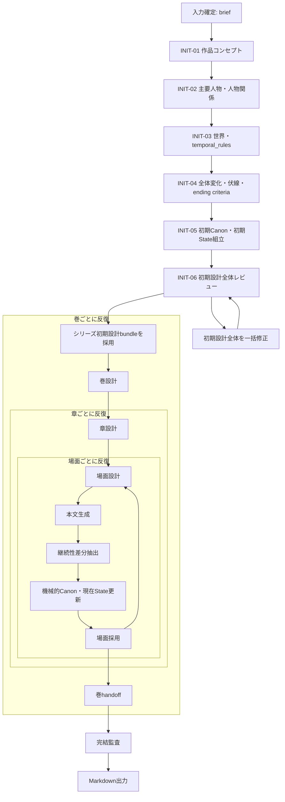

# シリーズ生成フロー設計

> 製品上の正本は[製品仕様](../product/SPECIFICATION.md)、採用・保存・停止の設計正本は[シリーズエンジン設計方針](series_engine_design.md)とする。この文書はLLM呼び出しの依存関係、順番、各呼び出しの責務を定める。

## 1. フローの読み方

図の外側は製品フェーズと採用済み正本の順番、各「品質改善対象」の内側はLLMの生成・全体レビュー・一括修正・全体再レビューを表す。レビューのseverityは外側の遷移を止めない。構造検証だけが候補の採否を決める。



実装時には、ループ終端を章数・場面数・巻数の採用済み設計から決定する。図の自己ループは、未処理の次の場面、章、巻へ進むことを表し、同じ成果物を再生成することを意味しない。

## 2. 共通品質改善呼び出し

品質改善対象は、初期設計、巻設計、章設計、場面設計、本文、継続性差分、巻handoff、完結意味監査である。各対象は次の呼び出し順を持つ。

```text
生成 → 機械的検証 → 対象全体レビュー → 全issueを一括修正
   → 機械的検証 → 対象全体の再レビュー → … → 採用・残存issue保存
```

- 修正は対象成果物全体と全issueを一回で渡す。issue別・field別・台帳別に分割しない。
- 上限後は最新の構造正常候補を採用する。残存issueは監査情報であり、停止条件ではない。
- 構造不正は有限回の生成または再抽出で回復を試みる。枯渇、LLM通信・JSON失敗、レビューJSON不正は停止する。

## 3. 初期設計のLLM呼び出し

| 呼び出し | 採用済み入力 | 出力・責務 | 変更してはならないこと |
|---|---|---|---|
| INIT-01 `initial_concept` | brief、編集プロファイル | 作品の核、ジャンル、読者体験、テーマ、主対立、終了方向 | 人物台帳詳細、章・場面・本文、ID |
| INIT-02 `initial_characters_relationships` | brief、INIT-01 | 主人公・中心人物、開始State、関係、認識差、長期変化 | ID、詳細章・場面、未確定世界設定 |
| INIT-03 `initial_world_temporal_rules` | brief、INIT-01、INIT-02 | 世界、場所、制度、重要物、`temporal_rules`、開始世界State | 全場面時点、ID、人物固定情報 |
| INIT-04 `initial_series_arcs` | brief、INIT-01〜03 | 長期変化、問い、伏線、重要イベント、major thread、`ending_criteria` | 巻別詳細、本文、ID |
| INIT-05 `initial_canon_assembly` | INIT-01〜04 | 初期Canon・初期State候補、知識状態 | 大量の新規主要創作、ID |
| INIT-06 `initial_design_review` | brief、INIT-01〜05、採番済み候補 | 初期設計全体のissue | 候補の直接修正 |
| `initial_design_revision` | 初期設計全体、INIT-06の全issue、変更範囲 | 一貫した初期設計全体の修正版 | 所有範囲外の変更、ID決定 |

`initial_design_review`は毎回全体を読む。`initial_design_revision`後には差分レビューではなく同じ全体レビューを行う。

## 4. 巻から場面までの呼び出し

| 呼び出し | 入力 | 出力・責務 |
|---|---|---|
| `volume_design` | 初期Canon・現在State、全体変化、前巻handoff、対象巻 | 巻目的、読者体験、人物・中心関係の開始/終了目標、thread、対立、巻末問い |
| `chapter_design` | 対象巻設計、現在Canon・State、前巻handoff | 順序付き章、目的、開始/終了目標、変化、thread action、場面数、章末機能 |
| `scene_card` | 巻・章設計、現在Canon・State、前場面handoff、`story_clock`、writer可視情報 | POV、場所、時間進行、目的、必須イベント、変化目標、thread action、開示制約、許可更新 |
| `scene` | 場面カード、writer投影、POV知識、読者開示、前場面handoff | 本文だけ |
| `continuity_delta` | 凍結本文、場面カード、開始Canon・State、更新許可 | handoff、既存更新、新規項目提案、knowledge、thread、`story_clock`差分 |

`scene`に作者真実、結末条件、他人物だけの秘密、将来の詳細を渡さない。`continuity_delta`は本文を変更せず、Canonを直接更新しない。

## 5. 機械的Canon更新

`continuity_delta`の後、コードが既存ID、許可field、`before`値、本文の完全一致evidence、新規項目の種別・重複、`story_clock`の単調性を確認する。通過後にコードが新規IDを採番し、既存更新、knowledge、thread、`story_clock`を一括で適用する。

本文、handoff、検証済み差分、更新済みCanon・現在State、新規項目、`story_clock`を一体で場面採用する。major thread、ending criterion、中心テーマ、作者真実、固定世界規則は本文差分から追加・変更しない。

## 6. 巻境界と完結

| 呼び出し・処理 | 入力 | 出力・責務 |
|---|---|---|
| `volume_handoff` | 場面handoff、章終了State、巻内Canon差分、人物・関係State、thread状態、`story_clock` | 次巻に必要な事実handoff。全本文の再投入やコード算出値の再計算をしない |
| `completion_audit` | 全採用状態、required ending criteria、本文evidence候補 | LLM意味監査のissue。結末情報の生成・修正や自己承認をしない |
| 機械的完結確認 | 計画、本文、thread、ending criteria、artifact | 成果物有無、空本文、required major thread、evidence候補、参照正常性を決定的に確認 |

機械的完成条件を満たした場合、`completion_audit`の残存issueは保存して出力へ進む。
