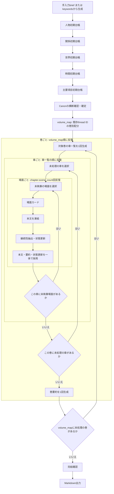

# シリーズ生成フロー設計

> 製品上の正本は[製品仕様](../product/SPECIFICATION.md)、再開・採用・出力の実装契約は[シリーズエンジン設計方針](series_engine_design.md)とする。この文書は、工程ごとの正本、LLMの責務、変更権限を定める。

## 目的

利用者が手入力briefまたは自由keywordsを一度だけ渡し、途中確認なしで完結した複巻小説Markdownを得る。keywords時はLLMがbriefを生成し、創作内容を評価せず手入力briefと同じ構造契約だけを通す。継続性情報は本文の補助メモではなく、本文より先に確定するCanonと、場面ごとに更新される現在状態で管理する。

## 工程の流れ

`volume_map` は確定Canonの既存thread IDを、各巻の `introduce`、`advance`、`resolve` 操作へ配分する。新しい人物、設定、因果、出来事、結末条件は作らない。表示用の `reader_question` は最終巻以外にだけ置き、結末到達条件の唯一の正本はbriefの `ending` とする。全巻の詳細章・場面・本文を最初に固定しない。各巻の章一覧は、その巻の開始時に、確定Canonと対象巻の操作、前巻までの採用済み要約を入力として作る。

図中の各LLM工程は、別文書の共通ライフサイクル（草稿 → 構造検証 → 批評 → 必要時revision → 最終批評 → 採用）を個別に通る。ここで示す矢印は、**採用済み正本を次の単位へ渡す外側の反復順**である。場面は`scene_card`、`scene`、`continuity`の三工程を完了して初めて採用済み場面になる。
## 正本と更新権限

| 正本 | 固定情報 | 現在状態 | 更新できる工程 |
|---|---|---|---|
| 人物 | プロフィール、物語上の役割 | 目的、圧力、場所、通常知識 | 許可済み場面の状態更新だけ |
| 関係 | 関係の意味 | 現在の関係、読者が知る関係 | 許可済み場面の状態更新だけ |
| 世界 | 場所・組織・重要物の事実、規則、利用条件 | 所在、所有、アクセス可否 | 許可済み場面の状態更新だけ |
| 時間 | 基準時点、期限、移動・回復規則 | 進行、実施済み、失効 | 許可済み場面の状態更新だけ |
| 主要項目 | 作者の真実、開示規則、導入・回収条件 | 未導入、進行中、回収済み | 許可済み場面の状態更新だけ |
| volume_map | 巻順、既存thread IDの操作、最終巻以外の表示用問い | なし | Canon確定後のvolume_map工程だけ |

固定プロフィール、世界規則、作者の真実、回収条件、volume_mapは、本文・要約・状態抽出のいずれも変更できない。

## IDと参照

- 初期台帳を生成するLLMは内容だけを返す。コードが保存時に永続IDを採番する。
- 関係以降の台帳は、採番済みの既知IDだけを参照できる。
- 場面カードは必要な既知IDだけを可視IDとして指定する。本文には可視IDに対応する情報だけを渡す。
- 更新許可IDは可視IDの部分集合である。未知ID、未提示ID、重複ID、固定情報への更新は拒否する。

## LLMの責務

| 工程 | 入力正本 | LLMが決めること | LLMが決めてはならないこと |
|---|---|---|---|
| brief | 手入力briefの検証、またはkeywordsからの初回brief生成 | keywords時の創作上の選択 | 創作内容の評価・批評・修正。構造契約だけを通す |
| 初期台帳 | brief、先行台帳 | 新規項目の内容と開始状態 | 永続ID、先行台帳の固定情報 |
| volume_map | 確定Canonの既存thread IDとbrief | 巻順、thread操作、表示用の問い | 新しい人物・設定・因果・出来事・結末条件、未知ID |
| 巻・章設計 | 対象volume_map、確定Canon、前巻要約 | 章の目的、開始・終了状態、場面数 | 将来巻の詳細、本文 |
| 場面カード | 対象章、局所台帳、前場面要約、同巻の時刻下限 | POV、開始終了時刻、場所、登場人物、必須行動、伏線操作、開示・秘匿、許可更新 | 新しい主要設定、未提示主要項目、同巻の確定済み終了時刻より前への逆行 |
| 本文 | 場面カード、writer view、前場面要約 | 自然な日本語の完成本文 | 状態更新、要約、本文外事実 |
| 継続性抽出 | 凍結本文、場面カード、許可更新候補 | 本文から完全一致で抜き出した根拠つき要約と実際の状態更新 | 本文の修正、本文外事実、未許可更新、要約・改変した根拠文字列 |
| 巻要約 | 対象巻の採用済み本文と状態 | 次巻への事実ベースの引継ぎ | 台帳・本文の上書き |
| 完結監査 | 全採用状態と主要項目 | 根拠不足・未回収の指摘 | 完結の自己承認、未回収項目の書換え |

批評者は対象工程の候補・入力・出力契約を読み、修正可能で根拠のあるissueだけを返す。修正者は対象工程の所有範囲だけを変更し、指摘されていない正しいID・順序・本文事実を失わない。定義済みのrevision回数を尽くした後の最終批評でissueが残った場合、最後に構造契約を通過した候補を受容して下流へ進む。残存issueと受容理由は`state.json`の`quality_acceptances`および出力の`quality-acceptances.json`に保存し、隠さない。最終批評が実行・検証できなかった場合、または候補が構造契約を満たさない場合は停止する。

## 本文と継続性の採用

本文と継続性抽出は別のLLM工程である。本文を先に凍結することで、要約や状態更新が本文にない人物、出来事、秘密、時間経過を創作することを防ぐ。

状態更新には、対象ID、現在状態の変更内容、採用場面ID、本文中の根拠を持たせる。コードは根拠、可視性、許可範囲、変更可能フィールドを検証し、本文・要約・更新を一つの場面成果物としてまとめて採用する。

## 完結条件

完結は以下をすべて満たすときだけ成立する。

1. 登録済みの主要項目がすべて回収済みである。
2. 最終巻の結末条件を裏付ける採用済み本文がある。
3. 計画された巻・章・場面に空本文・欠落がない。
4. 巻本文に重複がない。

LLMの完結監査は補助であり、上記のコード検証を置き換えない。
