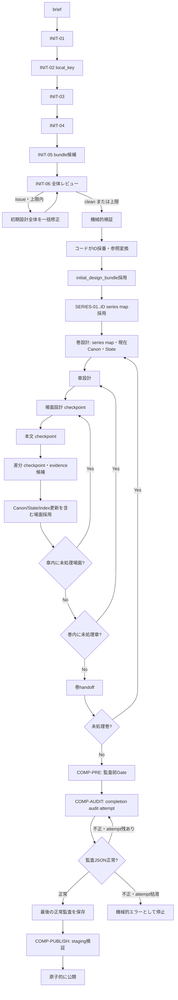

# シリーズ生成フロー設計

> 製品契約は[製品仕様](../product/SPECIFICATION.md)、採用・保存は[エンジン設計](series_engine_design.md)を正本とする。

## 呼び出し責務

- `series map`はINIT-ID後、VOL-01前に生成・review・採用する不変全巻計画である。
- `volume_design`の入力は採用済みbundle、現在Canon、現在State、前巻handoff、巻番号、残り巻数、編集プロファイル。
- `chapter_design`、`scene_card`、`scene`、`continuity_delta`、`volume_handoff`は共通revision loop対象。
- `continuity_delta`は型付きupdates、new item、knowledge/thread/clock、`ending_evidence_proposals`、handoffを出力する。
- 機械的更新はevidence indexを保存してから場面を原子的採用する。
- `completion_audit`はrevisionでなく同一入力からの独立attempt。issueを材料に監査JSONを直さない。

## 品質・停止

共通loopは「生成→構造検証→全体レビュー→全issue一括修正→再レビュー」。review issueは停止しない。transport retry、review構造retry、revision内の構造再生成、revision roundは別に数える。通信・構造回復の枯渇だけが停止条件である。
